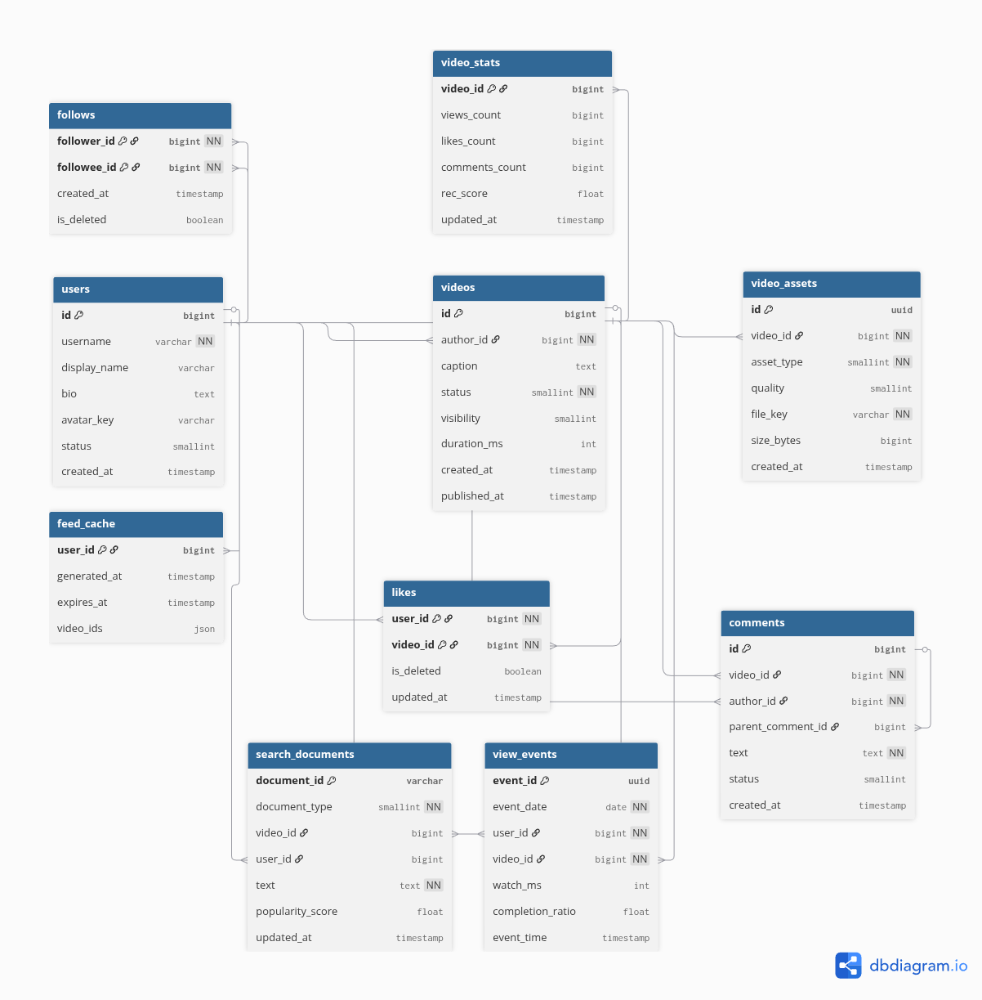
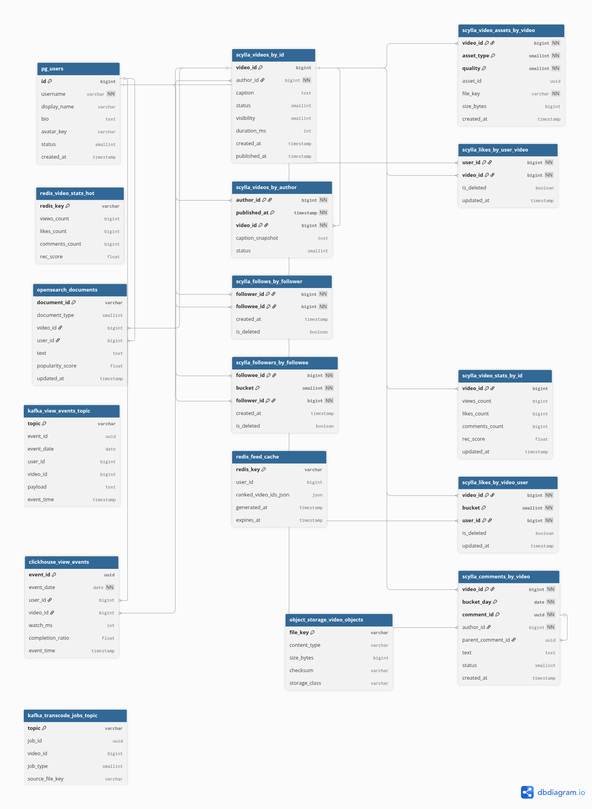
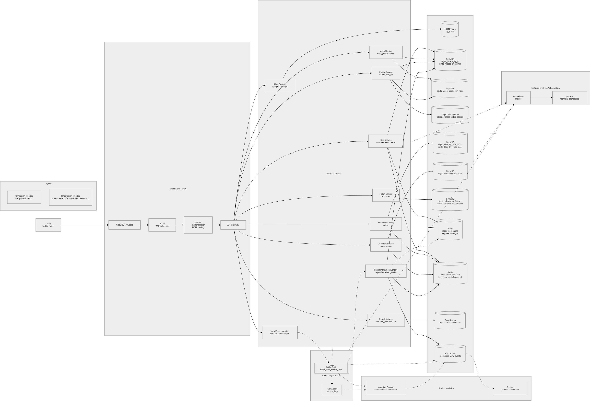

# Highload(TikTok)
Проектирую высоконагруженное приложение(TikTok)


## ДЗ1:  

Тип: платформа коротких видео с алгоритмической рекомендательной лентой

Ключевой функционал(MVP):

1) Персонализированная лента видео
2) Загрузка видео
3) Лайки
4) Комментарии
5) Подписки
6) Поиск видео, авторов

Ключевые продуктовые решения:

1) Основной экран сервиса - рекомендательная лента, формируемая на основе взаимодействий пользователя (просмотры, досматриваемость, лайки, подписки).
   Рекомендации обновляются периодически с учётом новых действий пользователей

2) Загруженные видео сохраняются в распределённом объектном хранилище (origin storage) и доставляются пользователям через CDN, что снижает задержки воспроизведения и нагрузку на backend

3) После загрузки видео проходит асинхронную обработку: транскодирование в несколько качеств и генерацию превью. Видео становится доступным пользователям после завершения обработки

4) Видео доступны в нескольких вариантах качества, которое подбирается автоматически в зависимости от скорости сети и устройства пользователя

5) События просмотров, лайков и комментариев агрегируются перед записью в БД, поэтому счётчики могут обновляться с небольшой задержкой(eventual consistency)

6) Поиск реализуется по авторам и текстовым описаниям видео с использованием полнотекстового индекса для быстрого поиска и ранжирования результатов.

ВАЖНО:

Официальные данные по MAU/DAU тикток не публикует, а в разных источниках она отличается. Будем придерживаться самых наибольших показателей
Примечание: Многие источники ссылаются на statista.com, в котором некоторые статьи можно просмотреть только с платным доступ. В этом случае,
как первоисточник, я указывал изначальные сайты.
MAU: 1.99 Млрд [1]

Распределение по географии: [2]

```
Страна	                Количество пользователей (в миллионах)  
Индонезия	            180.11M   
Соединенные Штаты	    153.12M  
Бразилия 	            130.84M  
Мексика 	            98.96M  
Пакистан            	79.93M  
Вьетнам 	            76.06M  
Россия	            	66.70M  
Филиппины           	64.00M  
Таиланд             	56.63M  
Бангладеш	            56.22M  
```
## ДЗ2:

Нахождение основных данных для расчётов:

Согласно статье [3], для facebook MAU = 3.07 Млрд, DAU = 2.11 Млрд, т.е. DAU ≈ 69% от MAU для facebook.

Согласно статистике [4], приведённой ниже, пользователи tiktok проводят в нём ежедневно 1ч 37м, что является самым высоким показателем
среди массовых приложений(Источник ссылается на similarWeb, но я просмотрел остальные сайты, и там информация такая же, оставил этот источник для
сравнения с facebook).


Также известно, что тикток аудитория считается одной из самых вовлечённых, поэтому предположим, что для него
DAU = 75% от MAU, следовательно DAU = 0,75 * 1.99 ≈ 1.5 Млрд.
Для расчётов далее используется округлённое значение из формулы DAU = 0.75 × 1.99 млрд = 1.4925 млрд ≈ 1 493 млн. В сводной таблице значение округлено до 1.50 млрд для читаемости.


в исследовании [5] приведена выборка пользователей, из которой получены следующие данные:
1) среднее время использования приложения 27 минут/день
2) среднее количество просмотренных видеороликов 89/день
Получаем, 89/27 ≈ 3.29629 роликов за минуту. Возьмём этот коэффициент и экстраполируем его на более достоверные значения
времени пользователя в день[4]. Таким образом получаем 97 * 3.29629 ≈ 319.74 ролика в день на пользователя.
Получается, средний ролик длится ≈ 18.2 секунды.

из этой статистики[6], можно получить, что в среднем пользователь открывает тикток 12 раз в день(358.7 / 30 ≈ 12)


из исследования[5] получим среднюю статистику лайков(12%)


Исследования для разных социальных платформ показывают comment rate ≈ 0.3%, follow rate ≈ 0.15%; возьмём эти значения.

Размер видео можно оценить через битрейт мобильного стриминга.
Типичные битрейты:
| Качество | Bitrate |
|---|---|
| 480p | ~1 Mbps |
| 720p | ~2.5 Mbps |
| 1080p | ~5 Mbps |
средний ролик длится ≈ 18.2 секунды, средний bitrate ≈ 2 Mbps
размер видео = 2 Mb/s × 18.2 s = 36.4 Mb ≈ 4.55 MB. Для дальнейших расчётов округляем размер доставляемого видео до **4.56 MB**.
Размер upload видео = 20 MB
Пользователь загружает исходный файл, который обычно имеет более высокий битрейт.
Если принять bitrate ≈ 8 Mbps
8 Mb/s × 18.2 s = 145.6 Mb ≈ 18.2 MB
**Хранимый размер видео:** `upload × 3.5 = 70 MB`.

Таким образом, в данной работе используются следующие базовые оценки аудитории:

Основные Данные для расчётов:
| Метрика | Значение | Комментарий |
|---|---:|---|
| MAU | **1.99 млрд** | |
| DAU | **1.493 млрд** | `1.99 × 0.75 ≈ 1.493`; округление для расчётов |
| DAU / MAU | **75%** | |
| Пользователи загружают больше 23 млн видео в день | 16000 / минуту | [7] |
| Видео в одной выдаче ленты | 10 | получено эмпирически |
| Среднее число просмотренных видео | 319.74 / день | в расчётах округляется до **320** |
| Среднее число сессий | 12 / день | одна сессия может включать несколько запросов ленты |
| Запросов ленты на пользователя | **32 / день** | `320 просмотров / 10 видео в ответе = 32 запроса ленты` |
| Поисков на сессию | 0.25 | “1 in 4 TikTok users start searching within the first 30 seconds of opening the app”; используем это как приближение `0.25 search/session`. [8] |
| Like rate | 12% | [5] |
| Comment rate | 0.3% | |
| Follow rate | 0.15% ||
| View-события | 1 событие на 1 просмотр | batch=20 не применяется к backend-нагрузке |
| Доставляемое(stream) видео | 4.56 MB | |
| Загружаемое(upload) видео | 20 MB | расчётное допущение |
| Хранимое(stored) видео | **70 MB** | `upload × 3.5`: оригинал + 4 транскода (360p/480p/720p/1080p) + превью + CDN-overhead |
| Коэффициент пиковой нагрузки | **1.7** |  тикток - глобальный сервис |

### Сводная таблица продуктовых метрик

| Метрика | На пользователя в день | Формула | Глобально в день |
|---|---:|---|---:|
| Время в приложении | 97 минут | `1 493 млн × 97 мин` | **~2.414 млрд часов/день** |
| Сессии | 12 | `1 493 млн × 12` | **17.916 млрд сессий/день** |
| Просмотры видео | 320 | `1 493 млн × 320` | **477.760 млрд просмотров/день** |
| Запросы ленты | 32 | `1 493 млн × (320 / 10)` | **47.776 млрд запросов/день** |
| View-события | 320 | `1 493 млн × 320` | **477.760 млрд событий/день** |
| Лайки | 38.4 | `320 × 12%` | **57.331 млрд лайков/день** |
| Комментарии | 0.96 | `320 × 0.3%` | **1.433 млрд комментариев/день** |
| Подписки | 0.48 | `320 × 0.15%` | **716.64 млн подписок/день** |
| Поиски | 3 | `12 сессий × 0.25` | **4.479 млрд поисков/день** |
| Загрузки видео | - | по источнику [7] | **23 млн видео/день** |

#### Объём хранилища

**Расчёт:**
- Загрузок в день: 23 млн
- Хранимый размер одного видео: 70 MB
- Ежедневный прирост: `23 млн × 70 MB = 1 610 000 GB = 1 610 ТБ/сутки`
- За год: `1 610 × 365 = 587 650 ТБ ≈ 588 ПБ/год`

| Тип данных | Объём |
|---|---|
| Видеоконтент (прирост в сутки) | **~1 610 ТБ/сутки** |
| Метаданные (профили, лайки, подписки, комментарии) | **~несколько ТБ/сутки** (пренебрежимо мало относительно видео) |
| Накопленный архив (оценочно, за год) | **~588 ПБ** |

---

#### RPS по типам запросов

**Формулы:**
- Средний RPS = (DAU × действий/день) / 86 400 сек
- Пиковый RPS = Средний RPS × коэффициент пика **1.7** (глобальный сервис, размытый по часовым поясам)

| Действие | Действий/день (млн) | Средний RPS | Пиковый RPS | Комментарий |
|---|---:|---:|---:|---|
| **Получение ленты (feed)** | `1 493 × (320/10) = 47 776` | **552 963** | **940 037** | Одна сессия включает несколько запросов ленты по 10 видео |
| **Просмотр видео (stream)** | `1 493 × 320 = 477 760` | **5 529 630** | **9 400 370** | Запросы к CDN; основной трафик |
| **Отправка view-событий** | `1 493 × 320 = 477 760` | **5 529 630** | **9 400 370** | Без batch, одно событие на просмотр |
| **Лайк** | `1 493 × 320 × 0.12 = 57 331` | **663 556** | **1 128 044** | peak = avg × 1.7 |
| **Комментарий** | `1 493 × 320 × 0.003 = 1 433` | **16 589** | **28 201** | |
| **Подписка** | `1 493 × 320 × 0.0015 = 717` | **8 294** | **14 101** | |
| **Загрузка видео (upload)** | `23` | **266** | **453** | Запросы к upload/origin storage |
| **Поиск** | `1 493 × 12 × 0.25 = 4 479` | **51 840** | **88 128** | |

> **Примечание:** RPS просмотра видео — это запросы к CDN-edge узлам, а не к origin backend. View-события, лайки, комментарии, подписки, поиск и получение ленты относятся к backend/API-нагрузке.

---

#### Сетевой трафик


**Формула для CDN edge-трафика:**

`CDN edge traffic = DAU × watch_time_per_day × avg_bitrate`

Используем значения из продуктовых метрик:

- `DAU = 1 493 млн`
- `watch_time_per_day = 97 минут = 5 820 секунд`
- `avg_bitrate = 2 Мбит/с`

Суточный объём CDN edge-трафика:

`1 493 000 000 × 5 820 × 2 = 17 378 520 000 000 Мбит/сутки`

`17 378 520 000 000 Мбит / 8 = 2 172 315 000 000 MB ≈ 2 172 315 ТБ/сутки ≈ 2 172 ПБ/сутки`

Средний CDN edge-трафик:

`17 378 520 000 000 Мбит / 86 400 ≈ 201 140 278 Мбит/с ≈ 201 140 Гбит/с`

Пиковый CDN edge-трафик:

`201 140 × 1.7 ≈ 341 938 Гбит/с`

Для сетевых расчётов используются десятичные единицы: `1 ТБ = 1 000 ГБ`, так как пропускная способность сетевых интерфейсов обычно указывается в Gbit/s.

**Важно:** cache hit ratio CDN не уменьшает трафик `CDN edge → user`: пользователь всё равно получает видео с ближайшего edge-сервера. Cache hit ratio уменьшает только трафик `origin → CDN`, то есть дозагрузку объектов из origin storage в CDN PoP при cache miss.

Для оценки `origin → CDN` принимаем:

- `CDN cache hit ratio = 85%`
- `cache miss ratio = 15%`

Тогда трафик дозагрузки из origin:

- средний: `201 140 × 0.15 ≈ 30 171 Гбит/с`
- пиковый: `341 938 × 0.15 ≈ 51 291 Гбит/с`

**Остальной трафик:**

- Входящий upload: `23 млн загрузок/день × 20 MB = 460 ТБ/сутки`
- Внутренняя запись видео после обработки: `23 млн × 70 MB = 1 610 ТБ/сутки`

| Тип трафика | Суточный объём | Средний трафик | Пиковый трафик ×1.7 | Комментарий |
|---|---:|---:|---:|---|
| CDN edge → user | **~2 172 ПБ/сутки** | **~201 140 Гбит/с** | **~341 938 Гбит/с** | Глобальный egress всей CDN edge-сети к пользователям |
| Origin → CDN при cache miss 15% | **~326 ПБ/сутки** | **~30 171 Гбит/с** | **~51 291 Гбит/с** | Дозагрузка объектов из origin storage в CDN PoP |
| Upload входящий | **460 ТБ/сутки** | **~42.6 Гбит/с** | **~72.4 Гбит/с** | Трафик загрузки исходных видео |
| Запись processed video в object storage | **1 610 ТБ/сутки** | **~149.1 Гбит/с** | **~253.4 Гбит/с** | Внутренний трафик после транскодирования |

CDN edge-трафик — это глобальная нагрузка всей CDN-сети, распределённая по CDN PoP. Этот трафик не проходит через один origin ДЦ и не является нагрузкой на backend API.

---

### Сводная таблица RPS (средний и пиковый)

| Метод | Средний RPS | Пиковый RPS (×1.7) |
|---|---:|---:|
| Лента (feed) | **552 963** | **940 037** |
| Стриминг видео (CDN) | **5 529 630** | **9 400 370** |
| View-события | **5 529 630** | **9 400 370** |
| Лайк | **663 556** | **1 128 044** |
| Комментарий | **16 589** | **28 201** |
| Подписка | **8 294** | **14 101** |
| Upload видео | **266** | **453** |
| Поиск | **51 840** | **88 128** |

**Итоговая backend-нагрузка без CDN-стриминга:**

`940 037 + 9 400 370 + 1 128 044 + 28 201 + 14 101 + 453 + 88 128 ≈ 11 599 334 RPS`

**Итоговая CDN-нагрузка:**

`9 400 370 RPS` на CDN-edge по запросам видео и до `~341 938 Гбит/с` пикового исходящего трафика `CDN edge → user`.

При cache hit ratio 85% трафик дозагрузки из origin в CDN составляет около `~51 291 Гбит/с` в пике.

---

## ДЗ3: Глобальная балансировка нагрузки


### Функциональное разбиение по доменам

Сервис обслуживает три принципиально разных типа трафика: API-запросы к backend, тяжёлый видеопоток через CDN и загрузку видео в origin storage. Домены выделены под функции MVP — по одному домену на каждый независимо масштабируемый слой.

| Домен | Назначение |
|---|---|
| `api.tiktok.com` | Backend API: лента, лайки, комментарии, подписки, поиск |
| `auth.tiktok.com` | Аутентификация, выдача и обновление токенов |
| `upload.tiktok.com` | Загрузка видео от пользователей в origin storage |
| `cdn.tiktok.com` | Стриминг видео и доставка превью через CDN-edge узлы |

CDN-трафик не маршрутизируется напрямую в origin ДЦ. Пользователь получает видео с ближайшего CDN edge PoP. Origin ДЦ используется при cache miss, загрузке новых видео, инвалидации и прогреве кеша.

---

### Расположение дата-центров

#### Ключевые факторы выбора

Аудитория сервиса географически неоднородна. Из топ-10 стран по числу пользователей складываются несколько крупных кластеров:

- **Юго-Восточная Азия** (Индонезия + Вьетнам + Филиппины + Таиланд): **~377 млн**
- **Латинская Америка** (Бразилия + Мексика): **~230 млн**
- **США**: **~153 млн**
- **Южная Азия** (Пакистан + Бангладеш): **~136 млн**
- **Россия**: **~67 млн**

Проектируется **TikTok International**. Китай не входит в расчёты, так как в Китае работает Douyin как отдельный продуктовый и инфраструктурный контур.

Стриминг видео требует задержки **< 200 мс** до CDN-edge. Выбор ДЦ определяется двумя факторами:
1. **Близость к крупнейшим аудиториям** — ДЦ должны покрывать регионы с наибольшей концентрацией DAU.
2. **Пересечение с подводными кабельными магистралями** — для минимизации межрегиональной задержки и ускорения доступа к origin storage при cache miss.

#### Дата-центры


| ID | Расположение | Регион и обоснование |
|---|---|---|
| **DC1** | Сингапур | Главный интернет-хаб Юго-Восточной Азии. Охватывает Индонезию (180 млн), Филиппины (64 млн). Узел подводных кабелей SEA-ME-WE и Asia-America Gateway |
| **DC2** | Бангкок, Таиланд | Покрывает Таиланд (57 млн), Вьетнам (76 млн) и остальную ЮВА |
| **DC3** | Мумбаи, Индия | Покрытие Пакистана (80 млн), Бангладеш (56 млн) и Индии. Узел кабелей SEA-ME-WE 4/5 |
| **DC4** | Ашберн, США (Восток) | Крупнейший интернет-узел восточного побережья. Покрывает ~60% населения США и Канаду |
| **DC5** | Лос-Анджелес, США (Запад) | Покрывает западное побережье США. Точка присутствия транстихоокеанских кабелей — резервный вход трафика из Азии |
| **DC6** | Сан-Паулу, Бразилия | Бразилия (131 млн) и Мексика (99 млн) — суммарно **~230 млн** пользователей, второй по размеру кластер. Крупнейший узел кабелей Южной Атлантики |
| **DC7** | Москва | Россия (67 млн) и Восточная Европа. Доступ к европейским IXP |
| **DC8** | Франкфурт | Западная Европа. DE-CIX — крупнейшая мировая точка обмена трафиком |
| **DC9** | Токио, Япония | Восточная Азия: Япония (~60 млн), Южная Корея (~35 млн) и прочая Восточная Азия — суммарно **~150 млн** пользователей. Главный транстихоокеанский кабельный хаб Азии |

---

### Распределение запросов по дата-центрам


Распределение трафика пропорционально доле DAU в регионе. Доли рассчитаны от MAU 1 990 млн на основе известных данных по странам из ДЗ1. В старой версии оставшиеся **~26%** трафика были вынесены в строку «Прочие». В текущем расчёте эта строка убрана: оставшийся мировой трафик равномерно добавлен к существующим DC1–DC9, то есть примерно по **2.9 п.п.** к каждому дата-центру.

Доли распределения являются **проектным допущением**. Они нужны, чтобы весь мировой трафик был привязан к конкретным регионам обслуживания, а не оставался в абстрактной строке «Прочие».

Backend-нагрузка разделяется на два разных потока:

1. **Синхронный API-трафик** — feed, likes, comments, follows, upload, search:  
   `940 037 + 1 128 044 + 28 201 + 14 101 + 453 + 88 128 = 2 198 964 peak RPS`
2. **Асинхронный event ingestion** — view-события:  
   `9 400 370 peak events/s`

Итого backend/event-контур обрабатывает:

`2 198 964 + 9 400 370 = 11 599 334 peak событий/запросов в секунду`

CDN-стриминг считается отдельно, так как он обслуживается CDN edge-узлами:

- CDN video requests: **9 400 370 peak RPS**
- CDN edge → user egress: **~341 938 Гбит/с peak**
- Origin → CDN refill при cache miss 15%: **~51 291 Гбит/с peak**

#### Распределение API и event ingestion по origin/API дата-центрам

Эта таблица описывает только origin/API контур: динамический API, загрузку видео, ingestion событий, транскодинг и доступ к origin storage. CDN edge-серверы в эту таблицу не входят.

| Регион (ДЦ) | Страны / зона покрытия | Доля трафика | Пиковый API RPS | Пиковый view ingestion, events/s | Пиковый backend/event total |
|---|---|---:|---:|---:|---:|
| **DC1 Сингапур** | Индонезия, Филиппины, часть Океании | **~14.9%** | **327 401** | **1 399 611** | **1 727 012** |
| **DC2 Бангкок** | Таиланд, Вьетнам, часть ЮВА | **~12.9%** | **283 422** | **1 211 603** | **1 495 025** |
| **DC3 Мумбаи** | Пакистан, Бангладеш, Индия, часть Ближнего Востока | **~12.9%** | **283 422** | **1 211 603** | **1 495 025** |
| **DC4 Ашберн** | США Восток, Канада | **~7.9%** | **173 474** | **741 585** | **915 059** |
| **DC5 Лос-Анджелес** | США Запад | **~5.9%** | **129 495** | **553 577** | **683 072** |
| **DC6 Сан-Паулу** | Бразилия, Мексика, остальная Латинская Америка | **~15.9%** | **349 391** | **1 493 614** | **1 843 005** |
| **DC7 Москва** | Россия, СНГ, Восточная Европа | **~7.9%** | **173 474** | **741 585** | **915 059** |
| **DC8 Франкфурт** | Западная Европа, часть Африки и MENA | **~10.9%** | **239 443** | **1 023 596** | **1 263 039** |
| **DC9 Токио** | Япония, Южная Корея, Восточная Азия без Китая | **~10.9%** | **239 443** | **1 023 596** | **1 263 039** |
| **Итого** |  | **100%** | **2 198 964** | **9 400 370** | **11 599 334** |

Доли в таблице округлены до десятых процента. Из-за округления сумма отображаемых долей может незначительно отличаться от 100%, но расчёты RPS выполнены по нормализованным долям распределения.

Самым нагруженным origin/API-регионом после распределения становится **DC6 Сан-Паулу**: на него приходится около **15.9%** backend/event-трафика, то есть **~1.84 млн peak событий/запросов в секунду**. В ДЗ4 локальную балансировку нужно считать уже для DC6 как для худшего случая.

#### Распределение CDN-трафика по edge-регионам

Эта таблица описывает только CDN edge-контур. CDN edge-серверы — это отдельные серверы в edge PoP, а не API-серверы из origin ДЦ. Они обслуживают статический видеотрафик и отдают пользователям видео по `cdn.tiktok.com`.

| CDN-регион | Ближайший origin DC | Пиковый CDN RPS | Пиковый CDN edge → user | Пиковый Origin → CDN refill при cache miss 15% |
|---|---|---:|---:|---:|
| **SEA-1** | DC1 Сингапур | **1 399 611** | **50 911 Гбит/с** | **7 637 Гбит/с** |
| **SEA-2** | DC2 Бангкок | **1 211 603** | **44 072 Гбит/с** | **6 611 Гбит/с** |
| **South Asia** | DC3 Мумбаи | **1 211 603** | **44 072 Гбит/с** | **6 611 Гбит/с** |
| **US East** | DC4 Ашберн | **741 585** | **26 975 Гбит/с** | **4 046 Гбит/с** |
| **US West** | DC5 Лос-Анджелес | **553 577** | **20 136 Гбит/с** | **3 020 Гбит/с** |
| **LATAM** | DC6 Сан-Паулу | **1 493 614** | **54 330 Гбит/с** | **8 150 Гбит/с** |
| **RU/CIS** | DC7 Москва | **741 585** | **26 975 Гбит/с** | **4 046 Гбит/с** |
| **Europe + Africa/MENA** | DC8 Франкфурт | **1 023 596** | **37 233 Гбит/с** | **5 585 Гбит/с** |
| **East Asia** | DC9 Токио | **1 023 596** | **37 233 Гбит/с** | **5 585 Гбит/с** |
| **Итого** |  | **9 400 370** | **341 938 Гбит/с** | **51 291 Гбит/с** |

Самым нагруженным CDN-регионом становится **LATAM**: на него приходится около **54.3 Тбит/с** пикового CDN edge-трафика. Это не трафик одного дата-центра, а суммарная нагрузка CDN PoP региона.

---

### Распределение CDN edge-серверов

Основная нагрузка TikTok — это не API, а доставка видео. Поэтому CDN выделяется в отдельный слой. CDN PoP размещаются не только в городах с origin ДЦ, но и в крупных точках концентрации пользователей и интернет-обмена. Это уменьшает RTT до пользователя, повышает cache hit ratio и снижает нагрузку на origin storage.

CDN edge-серверы **не являются API-серверами**. Это отдельные cache-серверы в edge PoP. Origin/API ДЦ обслуживают динамические запросы и хранение, а CDN edge PoP обслуживают видеотрафик к пользователям.

Для оценки количества CDN edge-серверов используется **проектное допущение**, а не публичная конфигурация TikTok. Конфигурация **2×100GbE** выбрана как типовая для высокопроизводительного edge-сервера: например, NVIDIA ConnectX-6 Dx поддерживает два порта 100Gb/s или один порт 200Gb/s Ethernet [11], а Intel Ethernet Network Adapter E810-CQDA2 относится к 100GbE-адаптерам с dual-port QSFP28-конфигурацией [12].

- один CDN edge-сервер имеет **2×100GbE NIC**;
- целевая загрузка сетевых интерфейсов — **70%**, чтобы оставался запас на пики, отказ узлов, ребалансировку и неравномерность трафика внутри PoP;
- эффективная пропускная способность одного сервера: `200 × 0.7 = 140 Гбит/с`;
- количество серверов считается как `ceil(пиковый CDN-трафик / 140 × 1.2)`, где **1.2** — дополнительный резерв 20% на отказ узлов, ребалансировку и обслуживание.

#### Сводка по CDN-регионам

| CDN-регион | Ближайший origin DC | Peak CDN edge → user | Основные PoP | Кол-во edge-серверов |
|---|---|---:|---|---:|
| **SEA-1** | DC1 Сингапур | **50 911 Гбит/с** | Jakarta, Singapore, Manila, Kuala Lumpur, Sydney | **439** |
| **SEA-2** | DC2 Бангкок | **44 072 Гбит/с** | Bangkok, Ho Chi Minh City, Hanoi, Phnom Penh, Yangon, Vientiane | **381** |
| **South Asia** | DC3 Мумбаи | **44 072 Гбит/с** | Mumbai, Delhi, Karachi, Dhaka, Dubai, Colombo | **380** |
| **US East** | DC4 Ашберн | **26 975 Гбит/с** | Ashburn, New York, Miami, Atlanta, Toronto | **233** |
| **US West** | DC5 Лос-Анджелес | **20 136 Гбит/с** | Los Angeles, San Jose, Seattle, Dallas, Phoenix | **175** |
| **LATAM** | DC6 Сан-Паулу | **54 330 Гбит/с** | São Paulo, Rio de Janeiro, Mexico City, Bogotá, Santiago, Buenos Aires, Lima | **469** |
| **RU/CIS** | DC7 Москва | **26 975 Гбит/с** | Moscow, Saint Petersburg, Almaty, Tashkent, Yerevan, Tbilisi | **235** |
| **Europe + Africa/MENA** | DC8 Франкфурт | **37 233 Гбит/с** | Frankfurt, Amsterdam, London, Paris, Warsaw, Madrid, Milan, Istanbul, Johannesburg | **321** |
| **East Asia** | DC9 Токио | **37 233 Гбит/с** | Tokyo, Osaka, Seoul, Taipei, Hong Kong | **320** |
| **Итого** |  | **341 938 Гбит/с** |  | **2 953** |

Количество CDN-серверов в таблице — это суммарная ёмкость глобальной edge-сети, а не серверы одного дата-центра. Число серверов округляется вверх по каждому PoP, поэтому итог немного выше, чем при расчёте одной общей ёмкости для всего региона.

#### Детальное размещение CDN PoP

| CDN-регион | PoP | Доля регионального CDN-трафика | Peak traffic | Edge-серверов | Почему выбран этот город |
|---|---|---:|---:|---:|---|
| SEA-1 | Jakarta | 35% | **17 819 Гбит/с** | **153** | Крупнейшая аудитория в Индонезии, основной источник трафика региона |
| SEA-1 | Singapore | 25% | **12 728 Гбит/с** | **110** | Региональный интернет-хаб и ближайший origin DC1 |
| SEA-1 | Manila | 20% | **10 182 Гбит/с** | **88** | Покрытие Филиппин, одного из крупнейших рынков ЮВА |
| SEA-1 | Kuala Lumpur | 10% | **5 091 Гбит/с** | **44** | Покрытие Малайзии и резерв к Singapore/Jakarta |
| SEA-1 | Sydney | 10% | **5 091 Гбит/с** | **44** | Покрытие Океании без транзита всего видео через ЮВА |
| SEA-2 | Bangkok | 35% | **15 425 Гбит/с** | **133** | Ближайший PoP к DC2 и крупный узел Таиланда |
| SEA-2 | Ho Chi Minh City | 25% | **11 018 Гбит/с** | **95** | Покрытие юга Вьетнама и высокой мобильной аудитории |
| SEA-2 | Hanoi | 20% | **8 814 Гбит/с** | **76** | Покрытие севера Вьетнама |
| SEA-2 | Phnom Penh | 7% | **3 085 Гбит/с** | **27** | Локальное снижение задержки для Камбоджи |
| SEA-2 | Yangon | 7% | **3 085 Гбит/с** | **27** | Покрытие Мьянмы без дальнего маршрута в Bangkok |
| SEA-2 | Vientiane | 6% | **2 644 Гбит/с** | **23** | Покрытие Лаоса и резерв к Bangkok |
| South Asia | Mumbai | 35% | **15 425 Гбит/с** | **133** | Ближайший PoP к DC3 и основной кабельный узел Южной Азии |
| South Asia | Delhi | 20% | **8 814 Гбит/с** | **76** | Покрытие северной Индии и снижение RTT внутри региона |
| South Asia | Karachi | 15% | **6 611 Гбит/с** | **57** | Покрытие Пакистана |
| South Asia | Dhaka | 15% | **6 611 Гбит/с** | **57** | Покрытие Бангладеш |
| South Asia | Dubai | 10% | **4 407 Гбит/с** | **38** | Узел для Ближнего Востока и резерв к Mumbai/Frankfurt |
| South Asia | Colombo | 5% | **2 204 Гбит/с** | **19** | Покрытие Шри-Ланки и островного трафика |
| US East | Ashburn | 35% | **9 441 Гбит/с** | **81** | Крупнейший сетевой узел востока США и ближайший origin DC4 |
| US East | New York | 25% | **6 744 Гбит/с** | **58** | Высокая плотность пользователей и операторских сетей |
| US East | Miami | 15% | **4 046 Гбит/с** | **35** | Покрытие юго-востока США и транзит в Карибы/ЛатАм |
| US East | Atlanta | 15% | **4 046 Гбит/с** | **35** | Крупный региональный узел юго-востока США |
| US East | Toronto | 10% | **2 698 Гбит/с** | **24** | Покрытие Канады |
| US West | Los Angeles | 35% | **7 048 Гбит/с** | **61** | Ближайший PoP к DC5 и западному побережью США |
| US West | San Jose | 20% | **4 027 Гбит/с** | **35** | Кремниевая долина, высокая концентрация сетевой инфраструктуры |
| US West | Seattle | 15% | **3 020 Гбит/с** | **26** | Покрытие северо-запада США |
| US West | Dallas | 20% | **4 027 Гбит/с** | **35** | Центральный узел для балансировки между востоком и западом США |
| US West | Phoenix | 10% | **2 014 Гбит/с** | **18** | Резерв и покрытие юго-запада США |
| LATAM | São Paulo | 30% | **16 299 Гбит/с** | **140** | Крупнейший интернет-узел Бразилии и ближайший origin DC6 |
| LATAM | Rio de Janeiro | 15% | **8 150 Гбит/с** | **70** | Дополнительная ёмкость для Бразилии |
| LATAM | Mexico City | 20% | **10 866 Гбит/с** | **94** | Покрытие Мексики, второго крупного рынка региона |
| LATAM | Bogotá | 10% | **5 433 Гбит/с** | **47** | Покрытие севера Южной Америки |
| LATAM | Santiago | 10% | **5 433 Гбит/с** | **47** | Покрытие Чили и юга западного побережья Южной Америки |
| LATAM | Buenos Aires | 10% | **5 433 Гбит/с** | **47** | Покрытие Аргентины и соседних стран |
| LATAM | Lima | 5% | **2 717 Гбит/с** | **24** | Покрытие Перу и резерв к Bogotá/Santiago |
| RU/CIS | Moscow | 45% | **12 139 Гбит/с** | **105** | Основной узел России и ближайший origin DC7 |
| RU/CIS | Saint Petersburg | 20% | **5 395 Гбит/с** | **47** | Покрытие северо-запада России |
| RU/CIS | Almaty | 15% | **4 046 Гбит/с** | **35** | Покрытие Казахстана и Центральной Азии |
| RU/CIS | Tashkent | 10% | **2 698 Гбит/с** | **24** | Покрытие Узбекистана и соседних стран |
| RU/CIS | Yerevan | 5% | **1 349 Гбит/с** | **12** | Покрытие Кавказа |
| RU/CIS | Tbilisi | 5% | **1 349 Гбит/с** | **12** | Покрытие Кавказа и резерв к Yerevan |
| Europe + Africa/MENA | Frankfurt | 25% | **9 308 Гбит/с** | **80** | Главный европейский интернет-хаб и ближайший origin DC8 |
| Europe + Africa/MENA | Amsterdam | 15% | **5 585 Гбит/с** | **48** | Крупная точка обмена трафиком в Западной Европе |
| Europe + Africa/MENA | London | 15% | **5 585 Гбит/с** | **48** | Покрытие Великобритании и северо-запада Европы |
| Europe + Africa/MENA | Paris | 10% | **3 723 Гбит/с** | **32** | Покрытие Франции и соседних стран |
| Europe + Africa/MENA | Warsaw | 10% | **3 723 Гбит/с** | **32** | Покрытие Центральной и Восточной Европы |
| Europe + Africa/MENA | Madrid | 8% | **2 979 Гбит/с** | **26** | Покрытие Испании, Португалии и части Северной Африки |
| Europe + Africa/MENA | Milan | 7% | **2 606 Гбит/с** | **23** | Покрытие Италии и юга Европы |
| Europe + Africa/MENA | Istanbul | 5% | **1 862 Гбит/с** | **16** | Узел между Европой, Турцией и MENA |
| Europe + Africa/MENA | Johannesburg | 5% | **1 862 Гбит/с** | **16** | Снижение задержки для юга Африки |
| East Asia | Tokyo | 30% | **11 170 Гбит/с** | **96** | Ближайший PoP к DC9 и крупнейший узел Японии |
| East Asia | Osaka | 15% | **5 585 Гбит/с** | **48** | Резерв и покрытие западной Японии |
| East Asia | Seoul | 25% | **9 308 Гбит/с** | **80** | Покрытие Южной Кореи |
| East Asia | Taipei | 15% | **5 585 Гбит/с** | **48** | Покрытие Тайваня |
| East Asia | Hong Kong | 15% | **5 585 Гбит/с** | **48** | Международный сетевой узел Восточной Азии без включения Китая в продуктовый контур |

---

### Схема DNS- и Anycast-балансировки

Для `api.tiktok.com`, `auth.tiktok.com` и `upload.tiktok.com` используется **Geo-based DNS**. DNS возвращает адрес ближайшего origin ДЦ с учётом региона пользователя, состояния ДЦ и весов маршрутизации.

Для близко расположенных ДЦ применяется weighted routing:

| Пара ДЦ | Механизм |
|---|---|
| **DC1 Singapore / DC2 Bangkok** | Балансировка ЮВА между двумя ближайшими ДЦ, failover при деградации одного из них |
| **DC4 Ashburn / DC5 Los Angeles** | Разделение трафика США на восток и запад; часть центральных штатов может маршрутизироваться по latency |
| **DC7 Moscow / DC8 Frankfurt** | Резервирование Восточной Европы и части СНГ |
| **DC8 Frankfurt / DC3 Mumbai** | Резерв для MENA и части Африки при деградации одного из маршрутов |

Для `cdn.tiktok.com` используется **BGP Anycast**:

1. CDN-провайдер анонсирует один и тот же anycast-префикс из нескольких CDN PoP.
2. Пользовательский трафик попадает в ближайший PoP по BGP-маршруту, а не обязательно в ближайший origin ДЦ.
3. Если PoP деградирует или отключается, он отзывает BGP-анонс, и трафик автоматически уходит в следующий ближайший PoP.
4. Внутри PoP L4-балансировщик распределяет TCP/QUIC-соединения по CDN cache-серверам.

Пример адресного плана для CDN:

| Тип адресов | Префикс | Назначение |
|---|---|---|
| IPv4 Anycast | `203.0.113.0/24` | Публичный anycast-префикс для CDN edge |
| IPv6 Anycast | `2001:db8:100::/48` | Публичный IPv6 anycast-префикс для CDN edge |
| Origin private network | `10.0.0.0/8` | Внутренний обмен между origin ДЦ, transcoding и object storage |

Такой подход разделяет API и видео: API-запросы маршрутизируются в origin ДЦ через GeoDNS, а видеотрафик обслуживается ближайшими CDN edge-серверами через Anycast.

### Механизмы регулировки трафика между ДЦ


| Механизм | Где применяется | Назначение |
|---|---|---|
| **Weighted GeoDNS** | `api.tiktok.com`, `auth.tiktok.com`, `upload.tiktok.com` | Управление долями трафика между близкими origin/API ДЦ. Например, часть ЮВА распределяется между DC1 Singapore и DC2 Bangkok, а США — между DC4 Ashburn и DC5 Los Angeles. |
| **Latency-based routing** | Близкие пары ДЦ | Выбор ДЦ не только по стране пользователя, но и по измеренной сетевой задержке от провайдера/ASN пользователя. |
| **Active Health Checks** | Все origin/API ДЦ | Проверка доступности L4/L7, API-сервисов, Kafka ingestion и основных БД. При деградации ДЦ его вес в GeoDNS уменьшается или ДЦ выводится из выдачи. |
| **Traffic draining** | Плановые работы и частичная деградация | Перед обслуживанием или деплоем новые запросы постепенно переводятся в соседний ДЦ, а старые соединения завершаются без обрыва. |
| **Failover по региональным парам** | DC1/DC2, DC4/DC5, DC7/DC8, DC8/DC3 | Перевод трафика в соседний регион при аварии или перегрузке основного ДЦ. |
| **BGP Anycast withdraw** | CDN PoP | При деградации CDN PoP он отзывает BGP-анонс anycast-префикса, после чего пользователи автоматически маршрутизируются в ближайший доступный PoP. |

---

## ДЗ4: Локальная балансировка нагрузки


### 4.1 Схема балансировки нагрузки

Внутри origin/API дата-центра используется двухуровневая схема балансировки:

```text
Пользователь / CDN / мобильный клиент
        ↓
GeoDNS / региональный routing
        ↓
L4 Load Balancer: LVS/IPVS + Keepalived
        ↓
L7 Load Balancer: NGINX
        ↓
Kubernetes services: feed, likes, comments, follows, search, upload, view-ingestion
```

CDN-видеотрафик `cdn.tiktok.com` обслуживается отдельными CDN edge PoP и не проходит через API-балансировщики origin ДЦ. Через локальные балансировщики origin/API ДЦ проходят:

1. синхронный API-трафик: feed, likes, comments, follows, upload, search;
2. ingestion view-событий;
3. служебные запросы авторизации и маршрутизации к backend-сервисам.

#### L4-балансировщик

| Параметр | Значение |
|---|---|
| Реализация | **LVS/IPVS + Keepalived** |
| Уровень | L4, TCP/UDP |
| Режим | **Direct Routing**: L4 принимает входящий пакет на VIP и выбирает L7-узел; ответный трафик от L7 может идти напрямую к клиенту, что снижает нагрузку на L4 |
| Алгоритм | Weighted Round-Robin / Least Connections |
| Резервирование | **N × 2**: каждый активный L4-узел имеет резервный узел |

L4 отвечает на вопрос: **если L7-балансировщиков несколько, кто решает, куда идут пакеты?**

Ответ: входящий TCP-поток сначала приходит на Virtual IP L4-балансировщика. LVS/IPVS хранит таблицу соединений и выбирает конкретный NGINX-узел. После выбора все пакеты этого TCP-соединения направляются на тот же L7-узел, что сохраняет корректность TLS-сессии и keep-alive соединений.

Keepalived используется для health checks и VRRP/failover. Keepalived опирается на Linux Virtual Server/IPVS для L4-балансировки, а VRRP используется для отказоустойчивости виртуального IP [13]. В режиме Direct Routing LVS принимает входящие запросы и направляет их на real servers, а real servers могут отправлять ответы напрямую клиентам [14].

#### L7-балансировщик

| Параметр | Значение |
|---|---|
| Реализация | **NGINX** |
| Уровень | L7, HTTP/HTTPS |
| Функции | TLS termination, HTTP routing по `Host`/path, rate limiting, request buffering, proxying в backend-сервисы |
| Алгоритм | Least Connections / EWMA latency-aware routing |
| Резервирование | **N + 1** |

NGINX выполняет:

- **SSL/TLS Termination** — расшифровывает HTTPS на границе дата-центра;
- **HTTP routing** — направляет `/feed`, `/like`, `/comments`, `/search`, `/upload`, `/events/view` в соответствующие backend-сервисы;
- **Keep-alive к backend** — снижает overhead на установку TCP-соединений внутри ДЦ;
- **Request buffering** — сглаживает пики мелких event-запросов перед backend-сервисами.

---

### 4.2 Расчёт нагрузки для худшего ДЦ

Расчёт выполняется для **DC6 Сан-Паулу**, потому что в ДЗ3 после распределения остального мира он стал самым нагруженным origin/API-регионом.

| Параметр | Значение | Обоснование |
|---|---:|---|
| Доля трафика DC6 | **~15.9%** | ДЗ3, распределение API/event по origin/API ДЦ |
| Пиковый API RPS | **349 391 RPS** | feed, likes, comments, follows, upload, search |
| Пиковый view ingestion | **1 493 614 events/s** | view-события, одно событие на просмотр |
| Пиковая L7-нагрузка всего | **1 843 005 RPS/events/s** | `349 391 + 1 493 614` |

Для оценки сетевого трафика через L7 принимается консервативное допущение: **10 КБ на один L7-запрос/ответ**. Реальный view-event payload меньше, но использование одного среднего значения упрощает расчёт и даёт запас по сетевой ёмкости.

```text
Пиковый L7-трафик = 1 843 005 × 10 КБ × 8 бит
                 ≈ 147.4 Гбит/с
```

> Примечание: это не CDN-видеотрафик. CDN edge → user traffic для LATAM считается отдельно в ДЗ3 и обслуживается CDN PoP. Здесь учитывается только API/event-трафик origin ДЦ.

---

### 4.3 Расчёт количества L4-балансировщиков

Целевая конфигурация L4-узла:

| Параметр | Значение |
|---|---:|
| NIC | **100GbE** |
| Расчётный предел по сети | **100 Гбит/с** |
| Резервирование | **N × 2** |

Ограничитель для L4 — пропускная способность сети. В режиме **Direct Routing** L4-балансировщик находится только на входящем пути: он принимает клиентские TCP-пакеты на VIP и выбирает L7-узел, а ответы от L7 могут идти клиенту напрямую, минуя L4. Поэтому фактическая нагрузка на L4 ниже полной двунаправленной полосы L7.

Для расчёта оставляем консервативную верхнюю оценку и считаем, что через L4 проходит весь расчётный L7-трафик **147.4 Гбит/с**. Это даёт запас: реальный входящий API/event-трафик обычно ниже исходящего, так как request payload меньше response payload.

```text
Активные L4 = ceil(147.4 / 100) = 2
С учётом N × 2: 2 × 2 = 4 L4-сервера
```

Итого для DC6:

| Уровень | Активных узлов | Резерв | Итого |
|---|---:|---:|---:|
| **L4 LVS/IPVS** | **2** | **2** | **4** |

#### Проверка связки L4 100GbE → L7 10GbE

L4-узлы не отправляют весь поток на один NGINX. LVS/IPVS распределяет TCP-соединения по всему кластеру L7 и закрепляет соединение за выбранным NGINX-узлом в таблице соединений.

При пиковом L7-трафике **147.4 Гбит/с** и 18 L7-узлах:

```text
Пропускная способность всех L7 NIC = 18 × 10 Гбит/с = 180 Гбит/с
Эффективная пропускная способность NGINX по бенчмарку = 18 × 8.8 = 158.4 Гбит/с
При отказе одного L7-узла остаётся 17 × 8.8 = 149.6 Гбит/с > 147.4 Гбит/с
```

Следовательно, два активных L4-узла с 100GbE не создают узкое место и не перегружают отдельный L7: L4 распределяет соединения по L7-кластеру, а количество L7-узлов выбрано так, чтобы даже при отказе одного узла суммарная L7-ёмкость оставалась выше расчётного пика.

---

### 4.4 Расчёт количества L7-балансировщиков

Конфигурация L7-узла берётся такой же, как в исходном расчёте: NGINX-сервер с 16 CPU и сетевым интерфейсом 10GbE. Для оценки используются два ограничителя:

1. пропускная способность сети;
2. SSL/TLS termination.

| Параметр | Значение | Источник |
|---|---:|---|
| Пиковая L7-нагрузка DC6 | **1 843 005 RPS/events/s** | ДЗ3 |
| Пиковый L7-трафик DC6 | **~147.4 Гбит/с** | `1 843 005 × 10 КБ × 8` |
| HTTP throughput NGINX | **8.8 Гбит/с** | [9] |
| SSL CPS NGINX, RSA 2048 | **56 715 CPS** | [10] |

#### Ограничитель 1 — пропускная способность

```text
147.4 Гбит/с / 8.8 Гбит/с ≈ 16.75 → 17 активных L7-серверов
```

С учётом резервирования N + 1:

```text
17 + 1 = 18 L7-серверов
```

#### Ограничитель 2 — SSL/TLS Termination

View-события не считаются как новые TLS-соединения. Мобильный клиент держит постоянное HTTPS/HTTP/2-соединение и отправляет несколько API-запросов и event-запросов внутри уже установленной TLS-сессии. Поэтому для SSL/TLS termination корректнее считать не `RPS = CPS`, а интенсивность создания новых клиентских соединений.

Для оценки CPS используем число открытий приложения из ДЗ2:

```text
Глобально: 1 493 млн пользователей × 12 сессий/день = 17 916 млн сессий/день
Средний CPS глобально = 17 916 млн / 86 400 ≈ 207 361 CPS
Пиковый CPS глобально = 207 361 × 1.7 ≈ 352 514 CPS
DC6: 352 514 × 15.9% ≈ 56 050 CPS
```

Добавим запас ×2 на переподключения мобильных клиентов, смену сети Wi-Fi/LTE и дополнительные параллельные соединения:

```text
Расчётный TLS CPS для DC6 = 56 050 × 2 ≈ 112 100 CPS
112 100 / 56 715 ≈ 1.98 → 2 активных L7-сервера
С учётом N + 1: 2 + 1 = 3 L7-сервера
```

SSL/TLS termination **не является определяющим ограничителем**. Определяющим ограничителем остаётся пропускная способность L7-кластера:

```text
18 L7-серверов по сети > 3 L7-сервера по TLS CPS
```

---

### 4.5 Итоговая конфигурация балансировщиков для DC6

| Уровень | Количество | Конфигурация узла | Тип резервирования | Ограничитель |
|---|---:|---|---|---|
| **L4 LVS/IPVS** | **4** | CPU 8 cores, NIC 100GbE | **N × 2** | Пропускная способность сети |
| **L7 NGINX** | **18** | CPU 16 cores, NIC 10GbE | **N + 1** | Пропускная способность сети |

### 4.6 Итоговая логика обработки запроса

1. Пользователь по GeoDNS попадает в ближайший origin/API ДЦ.
2. Внутри ДЦ запрос приходит на Virtual IP L4-балансировщика.
3. LVS/IPVS выбирает один из L7 NGINX-узлов и закрепляет TCP-соединение за ним.
4. NGINX завершает TLS, анализирует HTTP path и проксирует запрос в нужный backend-сервис.
5. View-события после L7 направляются в ingestion pipeline, а не синхронно пишутся в основную OLTP-БД.
6. CDN-видеозапросы не проходят через этот контур: они обслуживаются CDN edge PoP через `cdn.tiktok.com`.


## ДЗ5: Логическая схема БД

В этом разделе описана логическая модель данных без привязки к конкретным СУБД, шардам и физическому размещению. Модель оставлена компактной и покрывает только MVP-функции: персонализированную ленту, загрузку видео, лайки, комментарии, подписки, поиск видео и авторов.

Для расчётов используются метрики из ДЗ2:

| Метрика | Значение |
|---|---:|
| MAU | **1.99 млрд** |
| DAU | **1.493 млрд** |
| Просмотры видео | **477.760 млрд/сутки** |
| Feed-запросы | **47.776 млрд/сутки** |
| View-события | **477.760 млрд/сутки** |
| Лайки | **57.331 млрд/сутки** |
| Комментарии | **1.433 млрд/сутки** |
| Подписки | **716.64 млн/сутки** |
| Загрузки видео | **23 млн/сутки** |
| Пиковый synchronous API RPS | **2 198 964 RPS** |
| Пиковый view ingestion | **9 400 370 events/s** |
| Пиковый backend/event total | **11 599 334 events/s + RPS** |

Допущения для логической схемы:

1. `video_assets` — это не сами видеофайлы, а метаданные файлов: оригинал, транскодированные варианты и превью. Бинарное содержимое лежит в объектном хранилище.
2. `view_events` — горячая потоковая таблица событий просмотра. В логической схеме она показана как сущность, но физически это Kafka + ClickHouse с TTL/архивацией.
3. `feed_cache.video_ids` — логический массив идентификаторов видео в порядке ранжирования. В физической схеме он хранится как JSON.
4. `search_documents` — полиморфный поисковый индекс для двух типов документов: видео и автор. Для видео текст строится из `caption`, для автора — из `username`, `display_name`, `bio`.
5. Отдельная таблица задач обработки убрана из логической схемы. Состояние обработки хранится в `videos.status`, а готовые файлы появляются в `video_assets`.
6. Хештеги, сессии и отдельные identity-таблицы не включаются в MVP-схему, чтобы не перегружать модель сущностями вне заявленного ключевого функционала.

### 5.1 Логическая схема БД



### 5.2 Описание логических таблиц

Размеры указаны без учёта индексов и репликации. Для потоковых данных явно указан срок хранения.

| Таблица | Назначение | Основные поля | Размер строки | Количество строк | Размер таблицы | Запись, пик | Чтение, пик |
|---|---|---|---:|---:|---:|---:|---:|
| **users** | Профили пользователей и авторов | `id`, `username`, `display_name`, `bio`, `avatar_url`, `status`, `created_at` | ~260 Б | 1.99 млрд | ~0.52 ТБ | ~500 QPS | ~100 000 QPS |
| **videos** | Метаданные видео и статус публикации | `id`, `author_id`, `caption`, `status`, `visibility`, `duration_ms`, `published_at` | ~320 Б | 8.395 млрд/год | ~2.69 ТБ/год | **453 QPS** | до **9.4 млн item-read/s** из metadata/cache layer |
| **video_assets** | Метаданные оригинала, транскодов и превью | `id`, `video_id`, `asset_type`, `quality`, `file_key`, `size_bytes` | ~160 Б | ~50.37 млрд/год, около 6 ассетов на видео | ~8.06 ТБ/год | ~2 718 QPS metadata writes | до **9.4 млн item-read/s** для manifest/variant lookup |
| **follows** | Граф подписок пользователь → автор | `follower_id`, `followee_id`, `created_at`, `status` | ~32 Б | ~300 млрд активных edges | ~9.6 ТБ | **14 101 QPS** | ~200 000 QPS |
| **likes** | Состояние лайка user → video | `user_id`, `video_id`, `is_deleted`, `updated_at` | ~32 Б | до ~20.93 трлн уникальных пар/год как верхняя оценка | до ~669.6 ТБ/год | **1 128 044 QPS** | до **9.4 млн lookup/s** |
| **comments** | Комментарии и ответы под видео | `id`, `video_id`, `author_id`, `parent_comment_id`, `text`, `status` | ~220 Б | ~523.15 млрд/год | ~115.1 ТБ/год | **28 201 QPS** | ~94 000 QPS |
| **view_events** | Сырые события просмотров | `event_id`, `user_id`, `video_id`, `watch_ms`, `completion_ratio`, `event_time` | ~80 Б | ~14.33 трлн/30 дней | ~1.15 ПБ/30 дней | **9 400 370 events/s** | **9 400 370 events/s** consumer reads |
| **video_stats** | Агрегированные счётчики и скоринг видео | `video_id`, `views_count`, `likes_count`, `comments_count`, `rec_score` | ~64 Б | 8.395 млрд/год | ~0.54 ТБ/год | через stream aggregation | до **9.4 млн item-read/s** |
| **feed_cache** | Предрассчитанная персональная лента | `user_id`, `generated_at`, `expires_at`, `video_ids` | ~1.5 КБ | 1.493 млрд active users | ~2.24 ТБ | до **117 000 QPS** refresh/write | **940 037 QPS** feed reads |
| **search_documents** | Полнотекстовый индекс видео и авторов | `document_id`, `document_type`, `video_id`, `user_id`, `text`, `popularity_score` | ~512 Б | ~10.39 млрд docs: users + videos | ~5.32 ТБ без overhead индекса | ~453 QPS upload indexing + profile updates | **88 128 QPS** |

#### Пояснения к неоднозначным полям

| Поле | Пояснение |
|---|---|
| `users.avatar_url` | В логической схеме это ссылка на аватар. В физической схеме лучше хранить `avatar_key`, а CDN URL собирать на уровне приложения. |
| `videos.status` | Хранит lifecycle видео: `UPLOADING`, `PROCESSING`, `PUBLISHED`, `BLOCKED`, `DELETED`, `FAILED`. Отдельная таблица processing jobs не нужна в логической модели. |
| `video_assets.asset_type` | Тип ассета: original, transcode, thumbnail/preview. |
| `video_assets.quality` | Качество варианта: 360p/480p/720p/1080p или `0` для preview/original, если качество неприменимо. |
| `feed_cache.video_ids` | Логический массив идентификаторов видео в порядке ранжирования. В физической схеме хранится как JSON-массив. |
| `search_documents.document_type` | `1 = video`, `2 = author`. Для video `text = caption + author display_name`, для author `text = username + display_name + bio`. |
| `video_stats.rec_score` | Производный скор рекомендаций. Его считает recommendation pipeline по событиям просмотров, лайкам, комментариям и свежести видео. |
| `follows.status` | Нужен для soft delete и возможного pending-state закрытых аккаунтов. Если закрытые аккаунты не реализуются, можно трактовать как `is_deleted`. |

### 5.3 Требования к консистентности

| Тип консистентности | Таблицы / сущности | Обоснование |
|---|---|---|
| **Strict / Read-your-write** | `users`, `videos.status`, `video_assets` | Пользователь должен видеть созданный профиль и статус загруженного видео. Видео нельзя показывать до появления обязательных ассетов. |
| **Read-your-write для автора действия** | `likes`, `comments`, `follows` | Пользователь должен сразу видеть свой лайк, комментарий или подписку. Для остальных пользователей допустима небольшая задержка. |
| **Eventual consistency** | `video_stats`, `feed_cache`, `search_documents` | Счётчики, лента и поиск могут обновляться с задержкой в секунды/минуты без критичного влияния на UX. |
| **Append-only / At-least-once** | `view_events` | View-события не должны теряться, но могут приходить повторно. Дедупликация выполняется по `event_id`/idempotency key в consumer layer. |
| **Rebuildable cache** | `feed_cache`, CDN cache, hot metadata cache | Кэш можно восстановить из primary storage и event log. |

### 5.4 Особенности распределения нагрузки по ключам

| Сущность | Основной ключ нагрузки | Риск | Способ компенсации |
|---|---|---|---|
| **videos / video_stats** | `video_id` | Вирусные ролики создают hot key на счётчиках | Bucketed counters `video_id + bucket`, Redis hot counters, periodic flush в durable storage |
| **view_events** | `video_id`, `user_id` | При партиционировании только по `video_id` вирусный ролик перегреет одну партицию | Два потока: по `user_id` для user features и по `video_id + bucket` для счётчиков |
| **likes** | `(user_id, video_id)`, `video_id` | Нужна и проверка состояния лайка, и агрегация лайков видео | Двойная запись в user-oriented и video-oriented физические таблицы |
| **comments** | `video_id` | Популярное видео концентрирует чтение/запись комментариев | Bucket по дню: `video_id + bucket_day` |
| **follows** | `follower_id`, `followee_id` | Популярные авторы создают hot partition на подписчиках | Две физические проекции: by follower и by followee + bucket |
| **feed_cache** | `user_id` | Очень частое чтение при открытии ленты | TTL cache, background refresh, fallback на онлайн-кандидаты при cache miss |
| **search_documents** | текстовые токены, `document_type` | Горячие поисковые запросы | OpenSearch replicas, query cache, отдельный ranking score |

---

## ДЗ6: Физическая схема БД

Физическая схема показывает, как логические сущности из ДЗ5 раскладываются по конкретным хранилищам. В отличие от логической схемы, здесь допускается денормализация и дублирование данных под конкретные паттерны чтения.

Ключевое отличие ДЗ6 от ДЗ5:

- ДЗ5 отвечает на вопрос **«какие сущности есть в продукте»**.
- ДЗ6 отвечает на вопрос **«где и в каком виде эти сущности физически лежат, как индексируются, шардируются и резервируются»**.

### 6.1 Физическая схема БД



### 6.2 Выбор СУБД потаблично

| Логическая сущность | Физическое хранилище | Причина выбора |
|---|---|---|
| `users` | **PostgreSQL `pg_users`** | Профиль пользователя требует уникального `username`, транзакционных обновлений и удобных точечных запросов по `id`. |
| `videos` | **ScyllaDB `scylla_videos_by_id`, `scylla_videos_by_author`** | Видео читаются огромным числом key-value запросов по `video_id`, а профиль автора требует отдельной проекции по `author_id`. |
| `video_assets` | **ScyllaDB `scylla_video_assets_by_video` + Object Storage** | Метаданные ассетов читаются по `video_id`; сами файлы лежат в object storage, а не в БД. |
| `follows` | **ScyllaDB `follows_by_follower`, `followers_by_followee`** | Нужны быстрые запросы в обе стороны: подписки пользователя и подписчики автора. |
| `likes` | **ScyllaDB `likes_by_user_video`, `likes_by_video_user` + Redis counters** | Одна проекция нужна для liked-state пользователя, вторая — для восстановления/аудита лайков по видео. |
| `comments` | **ScyllaDB `comments_by_video`** | Основной запрос — последние комментарии конкретного видео. Bucket по дню ограничивает размер partition. |
| `view_events` | **Kafka → ClickHouse** | Поток view events слишком большой для OLTP-БД. Kafka буферизует события, ClickHouse хранит аналитику. |
| `video_stats` | **Redis hot counters + ScyllaDB durable snapshot** | Redis принимает частые INCR, ScyllaDB хранит периодически сброшенное долговременное состояние. |
| `feed_cache` | **Redis Cluster** | Лента должна открываться за миллисекунды. Данные rebuildable и имеют короткий TTL. |
| `search_documents` | **OpenSearch** | Поиск видео и авторов требует полнотекстового индекса, ранжирования и autocomplete. |

### 6.3 Денормализация

| Денормализация | Где хранится | Зачем нужна |
|---|---|---|
| Видео автора дублируются в `scylla_videos_by_author` | ScyllaDB | Быстро показать профиль автора без secondary index и scatter-gather по всем видео. |
| Ассеты видео вынесены отдельно от карточки видео | `scylla_video_assets_by_video` | У одного видео несколько файлов: original, 360p/480p/720p/1080p, thumbnail. Карточка видео не раздувается. |
| Граф подписок записывается в две стороны | `follows_by_follower`, `followers_by_followee` | Нужны оба запроса: «на кого подписан пользователь» и «кто подписан на автора». |
| Лайки записываются в две проекции | `likes_by_user_video`, `likes_by_video_user` | Быстрая проверка liked-state и durable пересчёт лайков по видео. |
| Счётчики видео разделены на hot и durable слой | Redis `video_stats_hot`, ScyllaDB `video_stats_by_id` | Redis выдерживает частые INCR, ScyllaDB восстанавливает состояние после сбоя Redis. |
| Поисковый документ содержит текст и popularity score | OpenSearch `search_documents` | Search Service не ходит в primary DB за каждым результатом. |
| Feed cache хранит готовый ranked list | Redis `feed_cache` | Запрос ленты не запускает полный recommendation pipeline. |

### 6.4 Индексы, ключи доступа и размер индексов

Для PostgreSQL считаются B-Tree индексы. Для ScyllaDB под «размером индекса» ниже понимается приблизительный объём primary-key/index metadata и ключей в SSTable; это не отдельный вторичный индекс, но storage overhead по ключам всё равно нужно учитывать. Оценка грубая, с overhead `1.2–1.3`.

| Таблица | Ключ / индекс | Тип | Основной запрос | Оценка размера |
|---|---|---|---|---:|
| `pg_users` | `id` | Primary B-Tree | `WHERE id = ?` | `(8 + 8) × 1.99B × 1.3 ≈ 41 ГБ` |
| `pg_users` | `username` | Unique B-Tree | `WHERE username = ?` | `(24 + 8) × 1.99B × 1.3 ≈ 83 ГБ` |
| `pg_users` | `status` | B-Tree | модерация/служебные выборки | `~10–20 ГБ`, низкая селективность, можно не делать в MVP |
| `scylla_videos_by_id` | `PRIMARY KEY (video_id)` | Partition key | получить видео по id | `(8 + 8) × 8.395B × 1.2 ≈ 161 ГБ` |
| `scylla_videos_by_author` | `PRIMARY KEY (author_id, published_at, video_id)` | Partition + clustering | последние видео автора | `(8 + 8 + 8 + 8) × 8.395B × 1.2 ≈ 322 ГБ` |
| `scylla_video_assets_by_video` | `PRIMARY KEY (video_id, asset_type, quality)` | Partition + clustering | получить файлы видео | `(8 + 2 + 2 + 8) × 50.37B × 1.2 ≈ 1.2 ТБ` |
| `scylla_follows_by_follower` | `PRIMARY KEY (follower_id, followee_id)` | Partition + clustering | подписки пользователя | `(8 + 8 + 8) × 300B × 1.2 ≈ 8.6 ТБ` |
| `scylla_followers_by_followee` | `PRIMARY KEY (followee_id, bucket, follower_id)` | Bucketed partition | подписчики автора | `(8 + 2 + 8 + 8) × 300B × 1.2 ≈ 9.4 ТБ` |
| `scylla_likes_by_user_video` | `PRIMARY KEY (user_id, video_id)` | Partition + clustering | liked-state пользователя | `(8 + 8 + 8) × 20.93T × 1.2 ≈ 603 ТБ` верхняя оценка |
| `scylla_likes_by_video_user` | `PRIMARY KEY (video_id, bucket, user_id)` | Bucketed partition | лайки видео для пересчёта | `(8 + 2 + 8 + 8) × 20.93T × 1.2 ≈ 653 ТБ` верхняя оценка |
| `scylla_comments_by_video` | `PRIMARY KEY (video_id, bucket_day, comment_id)` | Partition + clustering | комментарии видео | `(8 + 4 + 16 + 8) × 523.15B × 1.2 ≈ 22.6 ТБ` |
| `scylla_video_stats_by_id` | `PRIMARY KEY (video_id)` | Partition key | счётчики видео | `(8 + 8) × 8.395B × 1.2 ≈ 161 ГБ` |
| `redis_feed_cache` | `feed:{user_id}` | Redis key + TTL | открыть ленту | индекс отсутствует; доступ по ключу |
| `redis_video_stats_hot` | `video_stats:{video_id}:{bucket}` | Redis hash key | горячие счётчики | индекс отсутствует; доступ по ключу |
| `clickhouse_view_events` | `PARTITION BY event_date ORDER BY (video_id, event_time, event_id)` | Sparse primary index | аналитика просмотров | `~0.5–1%` от hot data, ориентир `6–12 ТБ` при 30 днях |
| `opensearch_documents` | `text`, `document_type`, `popularity_score` | Inverted index + doc values | поиск видео/авторов | `~1.5–2×` от documents: `~8–11 ТБ` |
| `object_storage_video_objects` | `file_key` | Object key | отдача файла origin/CDN | индекс object storage, отдельно не считается как SQL-индекс |
| **Итого считаемых индексов / ключей** | — | — | PostgreSQL B-Tree + ScyllaDB primary-key overhead + ClickHouse sparse index + OpenSearch index | **~1.31–1.32 ПБ** |

> В итог не включены Redis-ключи и внутренний индекс object storage. Replication Factor и реплики также не учитываются: это логический объём индексов/ключей до умножения на репликацию. Основной вклад дают две таблицы лайков (`likes_by_user_video` и `likes_by_video_user`), потому что в расчёте используется верхняя оценка количества уникальных пар user-video за год.

### 6.5 Шардирование и резервирование

| Хранилище | Ключ шардирования | Резервирование | Обоснование |
|---|---|---|---|
| PostgreSQL `pg_users` | `hash(user_id)` | Primary + 2 replicas на shard, Patroni failover, WAL archive | Профили требуют ACID, а hash-sharding равномерно распределяет пользователей. |
| ScyllaDB `videos` | `video_id`, `author_id` | RF=3, LOCAL_QUORUM для критичных записей | Key-value доступ к видео и спискам автора. |
| ScyllaDB `likes` | `user_id`, `(video_id, bucket)` | RF=3, LOCAL_QUORUM/ONE в зависимости от операции | User-oriented и video-oriented проекции закрывают разные запросы. |
| ScyllaDB `comments` | `(video_id, bucket_day)` | RF=3 | Bucket по дню ограничивает размер partition у популярных видео. |
| ScyllaDB `follows` | `follower_id`, `(followee_id, bucket)` | RF=3 | Bucket по followee защищает популярных авторов от hot partition. |
| Redis Cluster `feed_cache`, `video_stats_hot` | hash slot по ключу; counters включают bucket | Master + replica на каждый slot | Горячие данные в памяти, failover Redis Cluster. |
| Kafka `view-events` | `user_id` и `video_id + bucket` | RF=3, min.insync.replicas=2 | Буферизация и повторное чтение событий. |
| ClickHouse `view_events` | distributed table по `cityHash64(video_id)`, партиция по `event_date` | ReplicatedMergeTree, 2-3 реплики | Быстрая аналитика по append-only потоку. |
| OpenSearch `search_documents` | routing по `document_type + hash(document_id)` | primary shards + replica shards | Масштабирование поиска и отказоустойчивость чтения. |
| Object Storage | hash по `file_key` / CRUSH placement | Erasure Coding + cross-region replication | Видео доминирует по объёму, поэтому хранится в объектном хранилище. |

### 6.6 Клиентские библиотеки и интеграции

| Компонент | Клиент / интеграция | Использование |
|---|---|---|
| PostgreSQL | `pgx` + PgBouncer | Профили пользователей, транзакционные обновления, пул соединений. |
| ScyllaDB | `gocql` / Scylla Go driver | Key-value и wide-column таблицы, token-aware routing. |
| Redis Cluster | `go-redis` cluster client | Feed cache, hot counters, TTL, pipeline. |
| Kafka | `confluent-kafka-go` или `segmentio/kafka-go` | View events, interaction events, consumer groups. |
| ClickHouse | `clickhouse-go` | Batch insert view events, аналитические запросы. |
| OpenSearch | Official Go client | Поиск видео и авторов, autocomplete. |
| Object Storage | AWS S3 SDK / Ceph RGW API | Multipart upload, signed URLs, lifecycle policies. |

### 6.7 Балансировка запросов и мультиплексирование подключений

| Уровень | Механизм | Назначение |
|---|---|---|
| PostgreSQL | PgBouncer перед shard primary/replica | Мультиплексирует backend-соединения в ограниченный пул к PostgreSQL. |
| ScyllaDB | Token-aware client-side routing | Клиент отправляет запрос сразу на ноду-владельца partition key. |
| Redis Cluster | Cluster-aware client + pipelining | Ключи маршрутизируются по hash slot, pipeline снижает RTT. |
| Kafka | Partition-aware producer | События пишутся в нужные partitions; consumer groups масштабируются по partitions. |
| ClickHouse | Distributed tables | Запросы и inserts параллелятся по шардам. |
| OpenSearch | Coordinating nodes | Координирующие узлы рассылают запрос по shards и собирают выдачу. |
| Object Storage | CDN origin shield | CDN забирает контент с origin shield, а не с каждого storage node. |

### 6.8 Схема резервного копирования

| Хранилище | Что резервируется | Метод | RPO / RTO |
|---|---|---|---|
| PostgreSQL | `pg_users` | Ежедневный full backup со standby + WAL archive | RPO минуты, RTO десятки минут на shard |
| ScyllaDB | `videos`, `video_assets`, `likes`, `comments`, `follows`, `video_stats` | Incremental snapshots, repair, RF=3 | RPO минуты/часы в зависимости от таблицы |
| Redis | feed cache и hot counters | Feed cache не бэкапится; hot counters периодически flush в ScyllaDB | Feed rebuild, counters восстанавливаются из durable snapshot/events |
| Kafka | `view-events`, `interaction-events` | RF=3, retention 24-72h | RPO близко к 0 при `min.insync.replicas=2` |
| ClickHouse | hot analytics partitions | ReplicatedMergeTree + periodic backup partitions в object storage | RPO часы, raw events можно переиграть из Kafka/S3 |
| OpenSearch | search index | Snapshot в object storage; индекс rebuildable из primary DB | RPO часы, rebuild допустим |
| Object Storage | original uploads, transcoded variants, previews | Erasure Coding, versioning, cross-region replication | RPO минуты, RTO зависит от региона и объёма |
| CDN cache | edge cache | Не резервируется | Rebuildable из origin object storage |

### 6.9 Итоговая физическая конфигурация данных

| Класс данных | Основное хранилище | Почему не одно общее хранилище |
|---|---|---|
| Профили | PostgreSQL | Нужны уникальность username, ACID и PITR. |
| Видео и социальные связи | ScyllaDB | Нагрузка слишком большая для одной реляционной схемы, доступ key-based. |
| Видеоассеты и превью | Object Storage + CDN | Бинарные объекты имеют сотни ПБ в год, их нельзя хранить в OLTP-БД. |
| События просмотров | Kafka + ClickHouse | Поток событий измеряется миллионами events/s. |
| Счётчики и лента | Redis + periodic flush в ScyllaDB | Нужны миллисекундные hot reads/writes и durable восстановление. |
| Поиск | OpenSearch | Нужен специализированный полнотекстовый индекс и ranking. |

## ДЗ7: Алгоритмы

В разделе описаны алгоритмы, которые напрямую связаны с новой логической и физической схемой БД: лента, view-events, лайки/комментарии, upload processing и поиск. Служебные таблицы processing jobs в БД не используются: состояние обработки хранится в `videos.status`, а готовые файлы появляются в `video_assets`.

### 7.1 Формирование персонализированной ленты

| Параметр | Описание |
|---|---|
| **Подход** | Candidate generation → ranking → diversification → Redis `feed_cache` |
| **Блок системы** | Feed Service, Recommendation Workers, Redis, ScyllaDB, OpenSearch |
| **Задача** | Вернуть 10 релевантных видео за один запрос `/feed` без полного пересчёта рекомендаций онлайн. |
| **Расчётная нагрузка** | `940 037 peak RPS` на получение ленты. |

#### Исходные данные

| Данные | Источник |
|---|---|
| Профиль пользователя | `pg_users` |
| История просмотров | Kafka/ClickHouse `view_events` |
| Лайки и комментарии | `scylla_likes_by_user_video`, `scylla_comments_by_video` |
| Подписки | `scylla_follows_by_follower` |
| Метаданные видео | `scylla_videos_by_id`, `scylla_video_assets_by_video` |
| Горячие счётчики | Redis `video_stats_hot` |
| Поисковые/текстовые кандидаты | OpenSearch `search_documents` |

#### Последовательность работы

1. Клиент вызывает `GET /feed?cursor=...`.
2. Feed Service читает Redis `feed:{user_id}`.
3. Если кэш заполнен, сервис берёт следующие кандидаты и проверяет, что видео имеет `status = PUBLISHED` и доступные assets.
4. Если кэш пустой, Recommendation Workers собирают кандидатов из подписок, похожих видео, трендов и новых видео с хорошими early signals.
5. Для кандидатов подтягиваются признаки: completion-rate, like-rate, comment-rate, свежесть, популярность автора, регион/язык.
6. Ranking присваивает score. Для РПЗ используется иллюстративная формула:

   `score = 0.45 × P(досмотр) + 0.25 × P(like) + 0.15 × P(comment/follow) + 0.10 × freshness - 0.05 × repeat_penalty`

   Коэффициенты — проектное допущение для пояснительной записки. В production веса обучаются ML-моделью и уточняются через A/B-тесты.
7. Diversification ограничивает повтор одного автора и однотипного контента.
8. Top-N сохраняется в Redis `feed:{user_id}` с TTL 5–30 минут.
9. Клиент получает первые 10 `video_id` и metadata.
10. Событие `feed_served` отправляется в Kafka для обучения и дедупликации повторных показов.

#### Обоснование

Полный online ranking по всему каталогу при `940k peak RPS` слишком дорогой. Поэтому тяжёлая часть выполняется асинхронно, а online-path в основном читает Redis и ScyllaDB.

---

### 7.2 Обработка view-событий и счётчиков

| Параметр | Описание |
|---|---|
| **Подход** | Event ingestion → Kafka → Redis counters → ClickHouse analytics → ScyllaDB durable stats |
| **Блок системы** | Event Ingestion Service, Kafka, Counter Workers, ClickHouse Consumers |
| **Задача** | Принять поток view-events без синхронной записи каждого события в OLTP-БД. |
| **Расчётная нагрузка** | `9 400 370 peak events/s`. |

#### Последовательность работы

1. Клиент отправляет view-event после просмотра/скролла.
2. Ingestion Service валидирует событие и вычисляет `event_id`/idempotency key.
3. Событие пишется в Kafka `view-events`.
4. Counter Workers читают Kafka батчами и дедуплицируют повторы перед обновлением счётчиков.
5. Hot counters обновляются в Redis `video_stats:{video_id}:{bucket}`.
6. ClickHouse Consumers пишут raw events в `clickhouse_view_events` с партиционированием по `event_date`.
7. Periodic flush workers сбрасывают агрегаты Redis в `scylla_video_stats_by_id`.
8. Recommendation Workers используют ClickHouse/Redis/ScyllaDB для feature engineering.

#### Где происходит дедупликация

Дедупликация выполняется **не в Ingestion Service**, а в consumer layer перед изменением счётчиков: Counter Workers используют TTL-cache/SETNX по idempotency key. В ClickHouse `event_id` сохраняется для повторного схлопывания при аналитических пересчётах.

---

### 7.3 Лайки, комментарии и подписки

| Параметр | Описание |
|---|---|
| **Подход** | State-table upsert + dual projection + async counter update |
| **Блок системы** | Interaction Service, Comment Service, Counter Workers |
| **Нагрузка** | Лайки: `1 128 044 peak RPS`, комментарии: `28 201 peak RPS`, подписки: `14 101 peak RPS`. |

#### Лайк

1. Клиент отправляет `POST /videos/{video_id}/like`.
2. Interaction Service проверяет пользователя и доступность видео.
3. Записывается состояние в `scylla_likes_by_user_video(user_id, video_id)`.
4. Параллельно пишется video-oriented проекция `scylla_likes_by_video_user(video_id, bucket, user_id)`.
5. Событие `like_event` уходит в Kafka.
6. Counter Worker обновляет Redis hot counter.
7. Redis counters периодически сбрасываются в `scylla_video_stats_by_id`.

#### Комментарий

1. Клиент отправляет комментарий.
2. Comment Service проверяет видео, автора, антиспам-лимиты.
3. Комментарий пишется в `scylla_comments_by_video(video_id, bucket_day, comment_id)`.
4. Событие уходит в Kafka для счётчиков, уведомлений и модерации.

#### Подписка

1. Запись создаётся в `scylla_follows_by_follower`.
2. Зеркальная запись создаётся в `scylla_followers_by_followee`.
3. Две проекции нужны, чтобы быстро отвечать на два разных запроса: «на кого я подписан» и «кто подписан на автора».

---

### 7.4 Асинхронная обработка загруженного видео

| Параметр | Описание |
|---|---|
| **Подход** | Direct upload → `videos.status` → async workers → `video_assets` → publish |
| **Блок системы** | Upload Service, Media Workers, Moderation Workers |
| **Нагрузка** | `453 peak upload RPS`, около 6 обработанных ассетов на одно видео. |

#### Последовательность работы

1. Клиент запрашивает upload URL.
2. Upload Service создаёт `video_id` и запись в `scylla_videos_by_id` со статусом `UPLOADING`/`PROCESSING`.
3. Клиент загружает исходный файл напрямую в object storage.
4. Media Workers асинхронно создают варианты качества и превью.
5. Для каждого готового файла создаётся запись в `scylla_video_assets_by_video`.
6. Когда обязательные ассеты готовы и модерация пройдена, `videos.status` меняется на `PUBLISHED`.
7. После публикации отправляется событие `video_published` для feed и search indexing.
8. Если обработка не удалась, `videos.status` переводится в `FAILED` или `NEEDS_REVIEW`.

#### Переходы статусов видео

| Статус | Когда устанавливается | Видимость |
|---|---|---|
| `UPLOADING` | Выдан upload URL, файл ещё грузится | Не видно пользователям |
| `PROCESSING` | Файл загружен, создаются ассеты | Не попадает в feed/search |
| `PUBLISHED` | Готовы обязательные ассеты и модерация | Видно в feed/profile/search |
| `NEEDS_REVIEW` | Нужна ручная проверка | Не видно публично |
| `FAILED` | Обработка не завершилась после retry | Автор видит ошибку |
| `BLOCKED`/`DELETED` | Модерация или удаление | Недоступно |

Отдельная таблица `videos.status` не нужна в логической БД: это внутренняя очередь/состояние media pipeline, а не самостоятельная продуктовая сущность.

---

### 7.5 Индексация поиска видео и авторов

| Параметр | Описание |
|---|---|
| **Подход** | Event-driven indexing в OpenSearch |
| **Блок системы** | Search Service, Indexer Workers, OpenSearch |
| **Задача** | Быстрый поиск видео и авторов при `88 128 peak RPS`. |

#### Последовательность работы

1. После публикации видео отправляется событие `video_published`.
2. Indexer Worker читает событие и собирает документ типа `video`.
3. Для video-документа `text = caption + display_name автора + username автора`.
4. При изменении профиля автора Indexer Worker обновляет документ типа `author`.
5. Для author-документа `text = username + display_name + bio`.
6. Документы пишутся в OpenSearch `search_documents`.
7. При удалении/блокировке видео документ удаляется или помечается недоступным.
8. Search Service ищет в OpenSearch и обогащает выдачу актуальными счётчиками из Redis/ScyllaDB.

#### Альтернативы

| Альтернатива | Почему не выбрана |
|---|---|
| SQL `LIKE` по основной БД | Не подходит для глобального полнотекстового поиска и autocomplete. |
| Синхронная индексация в publish-запросе | Публикация видео зависела бы от доступности OpenSearch. |
| Хранить только video_id без text snapshot | Каждый search result требовал бы дорогой lookup в primary storage. |

## ДЗ8: Технологии

Граница протоколов фиксируется так: внешний клиентский API (`client → NGINX → API Gateway/backend-сервисы`) остаётся HTTP/HTTPS REST/JSON. Внутренние синхронные вызовы между сервисами выполняются по gRPC + Protobuf. Асинхронные события (`view`, `like`, `comment_created`, `follow_created`, `video_published`) передаются через Kafka, а не через gRPC.

| Технология | Область применения | Мотивационная часть |
|---|---|---|
| **TypeScript + React** | Web-клиент | Компонентная модель и статическая типизация подходят для ленты, профиля, поиска, комментариев и upload-flow. |
| **Kotlin** | Android-клиент | Нативная интеграция с Android video playback, background upload и сетевыми API. |
| **Swift** | iOS-клиент | Нативная работа с AVFoundation, background upload и системным декодированием видео. |
| **Go** | Backend API, Feed Service, Interaction Service, Upload Service, Event Ingestion | Высокая производительность на сетевом I/O, дешёвые goroutines, простая эксплуатация stateless-сервисов. |
| **Python** | Offline ML/recommendation jobs, feature engineering | Удобная экосистема для подготовки признаков и экспериментов с ranking-моделями. |
| **REST/HTTP API** | Внешний клиентский API: mobile/web → NGINX → API Gateway | Совместимость с мобильными клиентами, браузером, CDN/WAF и стандартными HTTP-инструментами. |
| **gRPC + Protobuf** | Внутренние вызовы между API Gateway, Feed, Interaction, Media и Search services | Типизированный контракт, компактная сериализация, HTTP/2 multiplexing и deadline propagation. |
| **LVS/IPVS + Keepalived** | L4-балансировка внутри ДЦ | VIP, распределение TCP-соединений и VRRP/failover. |
| **NGINX** | L7-балансировка и TLS termination | HTTP routing по `Host/path`, TLS termination, keep-alive и защита backend от прямого клиентского трафика. |
| **Kubernetes** | Оркестрация stateless-сервисов и воркеров | Rolling updates, self-healing, readiness/liveness probes, HPA по CPU/RPS/Kafka lag. |
| **Kubernetes Service Discovery / CoreDNS** | Service discovery внутри кластера | Сервисы находят друг друга по стабильным DNS-именам Kubernetes Service, а не по IP pod-ов. |
| **PostgreSQL** | `pg_users` | ACID, уникальность `username`, WAL/PITR и удобные транзакционные обновления профиля. |
| **PgBouncer** | Пул соединений PostgreSQL | Мультиплексирует backend-соединения в контролируемый пул к PostgreSQL. |
| **ScyllaDB** | `videos`, `video_assets`, `likes`, `comments`, `follows`, `video_stats` | Wide-column модель для key-based запросов с большим объёмом записи и чтения. |
| **Redis Cluster** | `feed_cache`, hot `video_stats` counters | In-memory latency для персональной ленты и горячих счётчиков. |
| **Apache Kafka** | Event bus: view-events, interactions, video lifecycle events | Буферизация миллионов событий в секунду, consumer groups, retention и повторное чтение при сбоях. |
| **ClickHouse** | Аналитика view-events и feature aggregation | Колоночное хранение и MergeTree-партиции подходят для append-only потока просмотров. |
| **OpenSearch** | Поиск видео и авторов | Инвертированные индексы, n-gram/autocomplete, текстовое ранжирование. |
| **Ceph RGW / S3-compatible object storage** | Хранение original uploads, transcoded variants, thumbnails | S3 API, multipart upload, erasure coding и горизонтальное хранение больших видеообъектов. |
| **CDN + BGP Anycast** | Доставка видео и превью | Основной видеотрафик не проходит через origin ДЦ; edge PoP уменьшают latency. |
| **FFmpeg** | Транскодирование видео и генерация превью | Формирование 360p/480p/720p/1080p и thumbnail. |
| **Prometheus + Alertmanager** | Метрики и алертинг | Сбор метрик, дедупликация и маршрутизация alerts. |
| **Grafana** | Дашборды observability | SLO, нагрузка по ДЦ, Kafka lag, Redis memory, Scylla p99, CDN cache hit ratio. |
| **Envoy** | Внутренний service mesh / circuit breaking | Circuit breaking и backpressure против каскадных отказов downstream-сервисов. |

## ДЗ9: Обеспечение надёжности

### 9.1 Сводная таблица по компонентам

| Компонент системы | Метод обеспечения надёжности |
|---|---|
| **GeoDNS / latency routing** | Weighted routing, active health checks, traffic draining перед обслуживанием ДЦ. При деградации региона его вес уменьшается или регион исключается из DNS-ответов. |
| **BGP Anycast для CDN** | Один anycast-prefix анонсируется из нескольких CDN PoP. При отказе PoP он withdraw-ит BGP-анонс, и трафик уходит в следующий ближайший PoP. |
| **CDN Edge PoP** | N+1 по edge-серверам внутри PoP. Edge cache не источник истины: при потере кэш заново прогревается из origin. |
| **L4 LVS/IPVS** | Резервирование N×2. Keepalived/VRRP переводит VIP на резервный L4-узел при отказе активного. |
| **L7 NGINX** | Резервирование N+1, active-active. Readiness checks исключают неисправные узлы, connection draining защищает in-flight запросы при деплое. |
| **Kubernetes services** | Несколько replicas, readiness/liveness probes, rolling update, PodDisruptionBudget, HPA по CPU/RPS/Kafka lag. |
| **PostgreSQL `pg_users`** | Primary + 2 replicas на shard, Patroni failover, WAL archive, ежедневные full backups со standby. |
| **ScyllaDB** | RF=3, LOCAL_QUORUM для критичных записей. При network partition без кворума запросы завершаются ошибкой/timeout, а не принимаются с риском split-brain-конфликтов. |
| **Redis Cluster** | Master + replica на hash slot, автоматический failover. `feed_cache` rebuildable, hot counters периодически сбрасываются в ScyllaDB. |
| **Kafka** | RF=3, `min.insync.replicas=2`, idempotent producers, consumer offsets commit после обработки. |
| **ClickHouse** | ReplicatedMergeTree, репликация hot partitions, backup partitions в object storage. |
| **OpenSearch** | Primary + replica shards, snapshots в object storage, индекс rebuildable из ScyllaDB/PostgreSQL/events. |
| **Object Storage / Ceph RGW** | Erasure Coding, versioning для originals, cross-region replication для origin-контента. |

### 9.2 Межрегиональный failover origin/API ДЦ

Origin/API ДЦ работают по региональной модели. У пользователя есть home region, где живут его основные записи. Если пользователь обслуживается из соседнего региона после аварии, запросы к его home data проксируются туда по межрегиональному каналу или временно работают в degraded-mode только для read-only/rebuildable функций.

| Сценарий | Поведение системы |
|---|---|
| Отказ одного origin/API ДЦ | GeoDNS health checks убирают ДЦ из выдачи; трафик уходит в ближайший резервный регион. |
| Отказ CDN PoP | PoP отзывает BGP-анонс, пользователи автоматически маршрутизируются в другой edge PoP. |
| Деградация object storage в регионе | Новые upload могут быть временно направлены в соседний origin; уже опубликованные видео продолжают отдаваться CDN edge. |
| Деградация Redis feed cache | Feed Service использует fallback: видео подписок, региональные тренды, свежие популярные видео. |
| Деградация OpenSearch | Поиск временно ограничивается cached/top queries; публикация видео не блокируется. |

### 9.3 Graceful Shutdown

1. Kubernetes отправляет pod-у SIGTERM.
2. Readiness probe начинает возвращать fail, и NGINX/Service перестаёт давать новые запросы на pod.
3. HTTP/gRPC сервер завершает текущие запросы в пределах grace period.
4. Kafka consumer перестаёт брать новые сообщения, дорабатывает текущий batch и commit-ит offset.
5. Сервис закрывает соединения с PostgreSQL, ScyllaDB, Redis, Kafka и ClickHouse.
6. Pod завершается без потери in-flight операций.

### 9.4 Graceful Degradation

| Сбой | Деградация |
|---|---|
| Redis `feed_cache` недоступен | Лента строится из подписок и trending-кандидатов. Персонализация хуже, но экран не пустой. |
| Redis hot counters недоступен | Лайки/просмотры принимаются через Kafka; счётчики на UI временно отстают. |
| OpenSearch недоступен | Поиск показывает cached популярные запросы или временную ошибку только в search-разделе. Feed/upload не затронуты. |
| ClickHouse недоступен | Raw events остаются в Kafka/S3, аналитика и обучение отстают, пользовательский API работает. |
| Object storage upload деградирует | Новые upload временно ограничиваются; просмотр опубликованных видео продолжается через CDN. |

### 9.5 Backpressure и защита от каскадных отказов

| Механизм | Где применяется | Назначение |
|---|---|---|
| Rate limiting | NGINX / API Gateway | Ограничение запросов от клиента/IP/device. |
| Circuit breaker | Envoy / service client | Быстро останавливает вызовы в деградирующий downstream. |
| Kafka buffering | View events, interactions, video lifecycle events | Downstream-системы обрабатывают события с собственной скоростью. |
| Bounded queues | Внутри Go-сервисов | Защита памяти от бесконечного накопления задач. |
| Bulkheads | Раздельные worker pools | Проблема поиска не должна съедать ресурсы feed/upload. |

### 9.6 SLO-метрики

| Компонент | SLO / метрика |
|---|---|
| API Gateway | p99 latency, 5xx rate, RPS, TLS errors |
| Feed Service | p99 feed latency, cache hit ratio, fallback rate |
| Event Ingestion | accepted events/s, Kafka produce latency, reject rate |
| Kafka | broker disk usage, under-replicated partitions, consumer lag |
| Redis | p99 latency, memory usage, evictions, failover count |
| ScyllaDB | p99 read/write latency, timeout rate, tombstones, repair status |
| ClickHouse | insert lag, part count, query p99 |
| OpenSearch | query p99, indexing lag, rejected requests |
| Object Storage | upload success rate, read latency, degraded PGs/OSDs |
| CDN | cache hit ratio, edge egress, origin refill traffic |

## 10.1 Общая схема взаимодействия сервисов

Схема показывает два контура: **origin/API** и **CDN edge**. Видеотрафик пользователей идёт через CDN, а origin/API отвечает за динамические запросы, загрузку видео, обработку событий, поиск и хранение исходных объектов.




## 10.2 Пояснения к схеме

| Поток | Как проходит | Задействованные компоненты |
|---|---|---|
| **Открытие ленты** | Клиент попадает через GeoDNS в ближайший origin/API ДЦ. Feed Service читает готовый список из Redis, обогащает его metadata и counters. | GeoDNS → L4 → L7 → API Gateway → Feed Service → Redis / ScyllaDB / PostgreSQL |
| **Обновление feed_cache** | Recommendation workers асинхронно пересобирают ленту по событиям просмотров и взаимодействий. | Kafka → Recommendation Workers → ClickHouse / ScyllaDB / Redis → Redis feed_cache |
| **Просмотр видео** | Клиент получает видео с ближайшего CDN PoP. При cache miss CDN идёт в origin shield и object storage. | BGP Anycast → CDN Edge → Origin Shield → Object Storage |
| **View-событие** | Ingestion быстро валидирует событие и пишет его в Kafka. Дальше независимые consumers обновляют Redis counters и ClickHouse. | API Gateway → View Event Ingestion → Kafka → Counter Workers / ClickHouse Consumers |
| **Лайк / комментарий / подписка** | Interaction Service пишет состояние в ScyllaDB, отправляет событие в Kafka и обновляет горячие счётчики. | API Gateway → Interaction Service → ScyllaDB / Kafka / Redis |
| **Загрузка видео** | Upload Service создаёт запись видео со статусом `PROCESSING`, клиент грузит файл в object storage, media workers создают ассеты и публикуют видео. | Upload Service → Object Storage → Kafka lifecycle events → Media Workers → ScyllaDB / OpenSearch |
| **Поиск** | Search Service ищет видео и авторов в OpenSearch, затем обогащает выдачу metadata/counters. | API Gateway → Search Service → OpenSearch → ScyllaDB / Redis / PostgreSQL |

На схеме Redis показан двумя логическими ролями: `feed_cache` и `hot video_stats counters`. Физически это может быть один Redis Cluster с разными префиксами ключей или два отдельных Redis Cluster, если нужно разделить память и SLA.

## 10.3 Обозначения потоков данных

| Обозначение | Значение |
|---|---|
| `read` / `r` | Синхронное чтение из хранилища. |
| `write` / `w` | Синхронная запись состояния. |
| `produce events` | Асинхронная публикация события в Kafka. |
| `INCR counters` | Быстрое изменение горячих счётчиков Redis. |
| `periodic flush` | Периодический сброс агрегатов в durable storage. |
| `metrics/logs` | Наблюдаемость: метрики, логи, трассировки. |

## 10.4 Связь схемы с балансировкой

- API-запросы идут через GeoDNS → L4 LVS/IPVS → L7 NGINX → API Gateway.
- CDN-видеотрафик идёт через BGP Anycast и не проходит через API-балансировщики origin ДЦ.
- Kafka и Redis отделяют синхронный пользовательский путь от тяжёлой асинхронной обработки.
- Object Storage является source of truth для бинарных видеообъектов, CDN cache является rebuildable.

---

## ДЗ11: Список серверов и расчёт ресурсов

### 11.1 Принцип расчёта

Серверы считаются отдельно для двух контуров:

1. **Origin/API ДЦ** — API, лента, события, поиск, загрузка, metadata, object storage.
2. **CDN edge** — cache-серверы, отдающие видео пользователям.

Подробный расчёт выполняется для **DC6 São Paulo** как самого нагруженного origin/API ДЦ. По ДЗ3 на него приходится:

| Метрика | Значение |
|---|---:|
| Доля глобальной нагрузки | **~15.9%** |
| Пиковый API RPS | **349 391 RPS** |
| Пиковый поток view events | **1 493 614 events/s** |
| Суммарная пиковая backend/event-нагрузка | **1 843 005 req/events/s** |
| Пиковые загрузки видео | **~72 video/s** |
| Пиковый CDN edge traffic региона | **54 330 Гбит/с** |

Общая формула:

```text
Необходимые ресурсы = пиковая нагрузка / производительность одного ядра или сервера
```

Для stateless-сервисов дополнительно применяется коэффициент запаса **1.2–1.3** на:

- сетевые накладные расходы;
- GC/runtime overhead;
- ретраи;
- rolling update;
- неравномерность распределения трафика;
- отказ части pod-ов или worker-node.

Остальные origin/API ДЦ масштабируются пропорционально своей доле трафика из ДЗ3.

---

### 11.2 Модель развёртывания

Для stateless-сервисов используется **Kubernetes на bare-metal worker-node**.

В Kubernetes запускаются:

- `api-gateway`;
- `feed-service`;
- `view-ingestion-service`;
- `interaction-service`;
- `search-service`;
- `upload-service`;
- `feed-refresh-workers`;
- `counter-flush-workers`;
- `search-index-workers`.

Kubernetes выбран, потому что stateless-сервисы требуют горизонтального масштабирования, rolling update, health checks, service discovery и автоматического перезапуска pod-ов.

Stateful-компоненты не запускаются как обычные Kubernetes workloads, а размещаются на выделенных bare-metal серверах:

- PostgreSQL;
- ScyllaDB;
- Redis Cluster;
- Kafka;
- ClickHouse;
- OpenSearch;
- Ceph/Object Storage;
- L4/L7-балансировщики;
- monitoring stack.

Причина: этим системам важны предсказуемый disk I/O, отсутствие CPU throttling, контроль сетевой полосы и стабильное размещение данных.

Для latency-sensitive сервисов CPU limits принимаются равными CPU requests, чтобы избежать CPU throttling. RAM limit используется как защитный механизм от утечек памяти и задаётся выше request.

---

### 11.3 Модель хостинга

Для проекта выбран гибридный подход.

| Контур | Модель | Обоснование |
|---|---|---|
| Origin/API дата-центры | Собственное железо / colocation | Нагрузка предсказуемая, объём хранения большой, стоимость облачного egress и storage была бы слишком высокой |
| CDN edge PoP | Собственные или арендованные edge-серверы в точках обмена трафиком | Основной видеотрафик должен обслуживаться рядом с пользователем, а не из origin ДЦ |
| Временные ML/CI/экспериментальные задачи | Облако / арендованные VM | Нужна гибкость, но эти задачи не являются постоянным критическим контуром |

Такой подход позволяет держать основную нагрузку на собственном железе, а временные и экспериментальные задачи выносить в облако.

---

### 11.4 Допущения по производительности узлов

| Тип узла | Конфигурация | Норма |
|---|---|---:|
| API worker node | 128 vCPU, 512 GB RAM, 2×100GbE | ~80–100 эффективных service cores |
| L4 LVS | 8 vCPU, 32 GB RAM, 100GbE | до 100 Гбит/с входящего L4-трафика |
| L7 NGINX | 16 vCPU, 64 GB RAM, 10GbE | 8.8 Гбит/с HTTP throughput |
| Kafka broker | 32 vCPU, 256 GB RAM, 4×7.68 TB NVMe, 100GbE | ~80k events/s logical load |
| ScyllaDB node | 64 vCPU, 512 GB RAM, 8×7.68 TB NVMe, 100GbE | key-value read/write с RF=3 |
| Redis node | 32 vCPU, 512 GB RAM, NVMe AOF | in-memory feed/cache/counters |
| ClickHouse node | 32 vCPU, 256 GB RAM, 8×7.68 TB NVMe | batch insert view events |
| OpenSearch node | 32 vCPU, 256 GB RAM, NVMe | search_documents + autocomplete |
| Ceph OSD node | 24–32 cores, 256 GB RAM, 36×22 TB HDD + NVMe WAL/DB | origin object storage |
| CDN edge node | cache disks, 2×100GbE | 140 Гбит/с эффективной отдачи при 70% загрузке NIC |

Нормы являются проектными допущениями. Для реального проекта их нужно уточнять нагрузочным тестированием на одном экземпляре сервиса и затем линейно масштабировать.

---

### 11.5 Расчёт stateless-сервисов для DC6

#### `api-gateway`

`api-gateway` обслуживает два разных типа нагрузки:

1. обычные API-запросы;
2. лёгкие view-events.

Их нельзя считать одной нормой, потому что API-запросы тяжелее, чем event ingestion.

```text
API traffic:
349 391 RPS / 8 000 RPS per core ≈ 44 cores

View events:
1 493 614 events/s / 25 000 events per core ≈ 60 cores

Итого:
44 + 60 = 104 cores

С запасом 20%:
104 × 1.2 ≈ 125 cores → 128 cores
```

#### `interaction-service`

В `interaction-service` входят лайки, комментарии и подписки.

```text
likes:    1 128 044 × 15.9% ≈ 179 259 RPS
comments:   28 201 × 15.9% ≈   4 484 RPS
follows:    14 101 × 15.9% ≈   2 242 RPS

Итого:
~186 000 RPS
```

Для interaction-service принимается консервативная норма **4 000 RPS/core**, так как сервис не только принимает запрос, но и обращается к ScyllaDB/Redis/Kafka.

```text
186 000 / 4 000 ≈ 46.5 cores
46.5 × 1.2 ≈ 56 cores → 64 cores
```

#### Сводная таблица stateless-сервисов

| Сервис | Пиковая нагрузка DC6 | Норма | CPU | RAM | Развёртывание |
|---|---:|---:|---:|---:|---|
| `api-gateway` | 349 391 API RPS + 1 493 614 events/s | 8k API RPS/core, 25k event/s/core | **128 cores** | 128 GB | 16 × 8 CPU |
| `feed-service` | ~149 465 feed RPS | 5k RPS/core | **36 cores** | 128 GB | 9 × 4 CPU |
| `view-ingestion-service` | 1 493 614 events/s | 25k events/core | **72 cores** | 128 GB | 9 × 8 CPU |
| `interaction-service` | ~186 000 RPS | 4k RPS/core | **64 cores** | 128 GB | 8 × 8 CPU |
| `search-service` | ~14 012 search RPS | 4k RPS/core | **8 cores** | 64 GB | 2 × 4 CPU |
| `upload-service` | ~72 upload/s | I/O-bound | **16 cores** | 64 GB | 4 × 4 CPU |
| `feed-refresh-workers` | async refresh | batch workers | **64 cores** | 256 GB | 8 × 8 CPU |
| **Итого stateless** | — | — | **388 cores** | **896 GB** | — |

С учётом Kubernetes overhead, DaemonSet-ов, sidecar-ов и operational reserve применяется коэффициент **1.3**:

```text
CPU: 388 × 1.3 ≈ 505 cores
RAM: 896 × 1.3 ≈ 1 165 GB
```

Один Kubernetes worker-node имеет:

```text
128 vCPU
512 GB RAM
2×100GbE
```

Минимально по ресурсам:

```text
CPU: 505 / 128 ≈ 4 nodes
RAM: 1165 / 512 ≈ 3 nodes
```

Но для отказоустойчивости, anti-affinity, rolling update и запаса под пики принимается:

```text
9 Kubernetes worker-node в DC6
```

---

### 11.6 Media / Transcode workers для DC6

Транскодинг считается по числу исходных видео. Для DC6:

```text
453 global upload/s × 15.9% ≈ 72 upload/s
Один media worker-node обрабатывает ~8 uploaded videos/s
72 / 8 = 9 active nodes
9 × 1.2 reserve ≈ 11 nodes
```

Итого для DC6 принимается **11 media/transcode worker-node**.

---

### 11.7 Расчёт Kafka broker-ов

Kafka используется для:

- `view_events_topic`;
- `transcode_jobs_topic`;
- service logs;
- product analytics;
- асинхронных событий лайков, комментариев и подписок.

Для Kafka используется эксплуатационная норма **80k events/s на broker**, а не теоретический максимум. Ограничитель — не CPU, а дисковая запись, сетевые реплики и retention.

При среднем размере события около **1 KB**:

```text
80k events/s × 1 KB ≈ 80 MB/s logical write
Replication Factor = 3
80 MB/s × 3 ≈ 240 MB/s replicated write traffic
```

Это укладывается в 4×NVMe и 100GbE, оставляя запас на protocol overhead, rebalancing partitions, retention, consumer lag и пики producer traffic.

Для DC6 используется верхняя оценка event/API-контура:

```text
1 843 005 events/s / 80 000 events/s per broker ≈ 23 brokers
```

С запасом на rebalancing, service logs и пики принимается:

```text
27 Kafka broker-ов
```

---

### 11.8 Stateful-компоненты для DC6

| Группа серверов | Кол-во в DC6 | Конфигурация | Размещённые сервисы | Обоснование |
|---|---:|---|---|---|
| **L4 LVS** | **4** | 8 vCPU, 32 GB RAM, 100GbE | LVS/IPVS + Keepalived | ДЗ4: 2 active + резерв N×2 |
| **L7 NGINX** | **18** | 16 vCPU, 64 GB RAM, 10GbE | NGINX, TLS termination | ДЗ4: ограничитель — сеть 147.4 Гбит/с |
| **Kubernetes Control Plane** | **3** | 8 vCPU, 32 GB RAM | kube-apiserver, scheduler, controller-manager, etcd | HA control-plane |
| **Kubernetes API Workers** | **9** | 128 vCPU, 512 GB RAM, 2×100GbE | API Gateway, Feed, Interaction, Search, Upload, Ingestion | Покрытие stateless CPU с запасом |
| **Media/Transcode Workers** | **11** | 128 vCPU, 512 GB RAM, NVMe scratch, 100GbE | FFmpeg, thumbnail, moderation preprocess | ~72 uploaded videos/s в DC6 |
| **Kafka Brokers** | **27** | 32 vCPU, 256 GB RAM, 4×7.68 TB NVMe | view-events, interaction events, video lifecycle events | `~1.84M events/s / 80k ≈ 23`, плюс reserve |
| **PostgreSQL** | **12** | 32 vCPU, 256 GB RAM, NVMe | `pg_users` | 4 logical shards × primary + 2 replicas |
| **ScyllaDB** | **60** | 64 vCPU, 512 GB RAM, 8×7.68 TB NVMe | videos, video_assets, likes, comments, follows, durable video_stats snapshots | RF=3, LOCAL_QUORUM, высокий key-value throughput |
| **Redis Cluster** | **32** | 32 vCPU, 512 GB RAM, NVMe AOF | feed_cache, hot video_stats counters | 16 masters + 16 replicas |
| **ClickHouse** | **12** | 32 vCPU, 256 GB RAM, 8×7.68 TB NVMe | view_events, aggregates, ML features | Высокий insert rate raw events |
| **OpenSearch** | **6** | 32 vCPU, 256 GB RAM, NVMe | search_documents | Поиск видео и авторов |
| **Ceph RGW / MON / MGR** | **6** | 16 vCPU, 64 GB RAM, 25/100GbE | Object storage gateways/control-plane | S3-compatible API |
| **Ceph OSD Storage** | **232** | 24–32 cores, 256 GB RAM, 36×22 TB HDD + NVMe WAL/DB | media objects | 15.9% годового media объёма + EC + 70% fill |
| **Monitoring** | **3** | 16 vCPU, 64 GB RAM, NVMe | Prometheus, Alertmanager, Grafana | HA monitoring |

Итого для DC6 без CDN edge: **435 серверов**.

Примечание по `video_stats`: в ScyllaDB хранится не primary hot-состояние счётчиков, а **durable aggregates**, которые периодически сбрасываются из Redis. Горячие `views_count`, `likes_count`, `comments_count`, `rec_score` находятся в Redis и обновляются через INCR/батчи.

---

### 11.9 Расчёт Ceph OSD для медиа

Для DC6 берётся 15.9% годового media volume:

```text
587.65 PB × 15.9% ≈ 93.44 PB logical/year
93.44 PB × 1.375 EC overhead / 0.7 fill ≈ 183.5 PB raw
Один OSD node: 36 × 22 TB = 792 TB raw
183 500 TB / 792 TB ≈ 232 OSD nodes
```

Итого для DC6 принимается **232 Ceph OSD node**.

---

### 11.10 Глобальная оценка серверов по origin/API ДЦ

| ДЦ | Backend/event total | L4 | L7 | K8s CP | K8s API workers | Media workers | Kafka | PostgreSQL | ScyllaDB | Redis | ClickHouse | OpenSearch | Ceph RGW | Ceph OSD | Monitoring | Итого |
|---|---:|---:|---:|---:|---:|---:|---:|---:|---:|---:|---:|---:|---:|---:|---:|---:|
| **DC1 Singapore** | 1 727 012 | 4 | 17 | 3 | 8 | 11 | 24 | 12 | 56 | 30 | 11 | 6 | 6 | 217 | 3 | **408** |
| **DC2 Bangkok** | 1 495 025 | 4 | 15 | 3 | 7 | 9 | 22 | 12 | 49 | 26 | 10 | 5 | 6 | 188 | 3 | **359** |
| **DC3 Mumbai** | 1 495 025 | 4 | 15 | 3 | 7 | 9 | 22 | 12 | 49 | 26 | 10 | 5 | 6 | 188 | 3 | **359** |
| **DC4 Ashburn** | 915 059 | 2 | 10 | 3 | 5 | 6 | 14 | 12 | 30 | 16 | 7 | 4 | 6 | 115 | 3 | **233** |
| **DC5 Los Angeles** | 683 072 | 2 | 8 | 3 | 4 | 5 | 10 | 12 | 23 | 12 | 5 | 3 | 6 | 86 | 3 | **182** |
| **DC6 São Paulo** | 1 843 005 | 4 | 18 | 3 | 9 | 11 | 27 | 12 | 60 | 32 | 12 | 6 | 6 | 232 | 3 | **435** |
| **DC7 Moscow** | 915 059 | 2 | 10 | 3 | 5 | 6 | 14 | 12 | 30 | 16 | 7 | 4 | 6 | 115 | 3 | **233** |
| **DC8 Frankfurt** | 1 263 039 | 4 | 13 | 3 | 7 | 8 | 18 | 12 | 42 | 22 | 9 | 5 | 6 | 159 | 3 | **311** |
| **DC9 Tokyo** | 1 263 039 | 4 | 13 | 3 | 7 | 8 | 18 | 12 | 42 | 22 | 9 | 5 | 6 | 159 | 3 | **311** |
| **Итого** | **11 599 334** | **30** | **119** | **27** | **59** | **73** | **169** | **108** | **381** | **202** | **80** | **43** | **54** | **1 459** | **27** | **2 831** |

---

### 11.11 CDN edge-серверы

CDN-серверы не входят в origin/API таблицу выше. Они рассчитаны в ДЗ3 по пиковому `CDN edge → user` трафику **341 938 Гбит/с**.

Допущение для одного CDN edge-сервера:

```text
2×100GbE NIC
целевая загрузка = 70%
эффективная пропускная способность = 200 × 0.7 = 140 Гбит/с
дополнительный резерв = 20%
```

Формула:

```text
edge_servers = ceil(CDN edge traffic / 140 × 1.2)
```

| CDN-регион | Peak traffic | Edge-серверов | Основные PoP |
|---|---:|---:|---|
| SEA-1 | 50 911 Гбит/с | 439 | Jakarta, Singapore, Manila |
| SEA-2 | 44 072 Гбит/с | 381 | Bangkok, Ho Chi Minh City, Hanoi |
| South Asia | 44 072 Гбит/с | 380 | Mumbai, Karachi, Dhaka |
| US East | 26 975 Гбит/с | 233 | Ashburn, New York, Atlanta, Miami |
| US West | 20 136 Гбит/с | 174 | Los Angeles, San Jose, Seattle, Dallas |
| LATAM | 54 330 Гбит/с | 469 | São Paulo, Rio de Janeiro, Mexico City, Bogotá, Santiago, Buenos Aires, Lima |
| RU/CIS | 26 975 Гбит/с | 233 | Moscow, Saint Petersburg, Almaty |
| Europe + Africa/MENA | 37 233 Гбит/с | 321 | Frankfurt, Amsterdam, London, Paris, Warsaw, Madrid, Milan, Dubai, Johannesburg |
| East Asia + Oceania | 37 233 Гбит/с | 323 | Tokyo, Osaka, Seoul, Taipei, Hong Kong, Sydney |
| **Итого** | **341 938 Гбит/с** | **2 953** |  |

---

### 11.12 Общий итог по серверам

| Категория | Количество серверов | Контур | Комментарий |
|---|---:|---|---|
| L4 LVS/IPVS | 30 | Origin/API | Входная L4-балансировка в 9 ДЦ |
| L7 NGINX | 119 | Origin/API | TLS termination и HTTP routing |
| Kubernetes Control Plane | 27 | Origin/API | 3 HA control-plane узла на ДЦ |
| Kubernetes API workers | 59 | Origin/API | Stateless API, feed, upload, ingestion |
| Media/Transcode workers | 73 | Origin/API | FFmpeg pipeline и moderation preprocess |
| Kafka brokers | 169 | Origin/API | View events, interaction events, video lifecycle events |
| PostgreSQL | 108 | Origin/API | `pg_users` |
| ScyllaDB | 381 | Origin/API | videos, video_assets, likes, comments, follows, durable video_stats snapshots |
| Redis Cluster | 202 | Origin/API | feed_cache, hot video_stats counters |
| ClickHouse | 80 | Origin/API | view_events, aggregates, ML features |
| OpenSearch | 43 | Origin/API | search_documents, video/author autocomplete |
| Ceph RGW/MON/MGR | 54 | Origin/API | Object storage gateways and control-plane |
| Ceph OSD Storage | 1 459 | Origin/API | Origin media storage for first year |
| Monitoring | 27 | Origin/API | Prometheus, Alertmanager, Grafana, logs/traces collectors |
| **Итого origin/API ДЦ** | **2 831** | **Origin/API** | 9 региональных origin/API ДЦ |
| CDN edge-серверы | 2 953 | CDN edge | Edge cache-серверы в PoP |
| **Итого глобально** | **5 784** | **Origin/API + CDN** | Глобальная инфраструктура MVP на горизонте первого года хранения |

Проверка арифметики:

```text
Origin/API: 2 831 сервер
CDN edge:  2 953 серверов
Итого:     5 784 сервера
```

---

### 11.13 Аллокация Kubernetes pod-ов для DC6

| Pod / Deployment | Replicas | CPU request | CPU limit | RAM request | RAM limit | Назначение |
|---|---:|---:|---:|---:|---:|---|
| `api-gateway` | 16 | 8 CPU | 8 CPU | 8 GB | 16 GB | REST API, auth middleware, routing |
| `feed-service` | 9 | 4 CPU | 4 CPU | 16 GB | 24 GB | Получение персонализированной ленты из Redis feed_cache |
| `view-ingestion-service` | 9 | 8 CPU | 8 CPU | 16 GB | 24 GB | Приём view events и запись в Kafka |
| `interaction-service` | 8 | 8 CPU | 8 CPU | 16 GB | 24 GB | Лайки, комментарии, подписки |
| `search-service` | 2 | 4 CPU | 4 CPU | 32 GB | 48 GB | Поиск видео и авторов через OpenSearch |
| `upload-service` | 4 | 4 CPU | 4 CPU | 16 GB | 24 GB | Загрузка видео, выдача upload URL, создание metadata |
| `feed-refresh-worker` | 8 | 8 CPU | 8 CPU | 32 GB | 48 GB | Пересборка feed_cache |
| `counter-flush-worker` | 4 | 4 CPU | 4 CPU | 8 GB | 16 GB | Сброс hot counters из Redis в ScyllaDB |
| `search-index-worker` | 4 | 4 CPU | 4 CPU | 8 GB | 16 GB | Обновление OpenSearch documents |
| `metrics-exporter` | daemonset | 0.2 CPU | 0.5 CPU | 256 MB | 512 MB | Метрики node/pod/service |

Суммарный CPU request:

```text
16×8 + 9×4 + 9×8 + 8×8 + 2×4 + 4×4 + 8×8 + 4×4 + 4×4 + 9×0.2
= 421.8 CPU
```

Суммарный RAM request:

```text
16×8 + 9×16 + 9×16 + 8×16 + 2×32 + 4×16 + 8×32 + 4×8 + 4×8 + 9×0.25
≈ 994 GB
```

В DC6 выделено 9 worker-node:

```text
9 × 128 CPU = 1152 CPU
9 × 512 GB = 4608 GB RAM
```

CPU используется как основной ограничитель. RAM остаётся с большим запасом, что допустимо для Kubernetes worker-node: память используется под page cache, runtime overhead, пики сериализации и пересборку feed cache.

Для Go-сервисов задаётся `GOMEMLIMIT` на уровне 80–90% от RAM limit контейнера, чтобы снизить риск OOM kill при пиковых нагрузках.

---

### 11.14 Вывод

Для worst-case origin/API-региона DC6 требуется:

```text
435 серверов origin/API контура
469 CDN edge серверов для LATAM CDN-региона
```

Глобально для всех 9 origin/API ДЦ:

```text
2 831 сервер origin/API инфраструктуры
```

Для CDN edge:

```text
2 953 edge-серверов
```

Общий итог:

```text
5 784 сервера
```

Большая часть серверов приходится на:

1. **CDN edge**, потому что видеотрафик доминирует над API-нагрузкой.
2. **Ceph OSD**, потому что хранение видео требует большого объёма дисков.
3. **ScyllaDB / Kafka / ClickHouse**, потому что view events и interaction events имеют очень высокий поток записи.

Stateless backend-сервисы занимают меньшую долю оборудования и масштабируются горизонтально через Kubernetes.


### 11.15 Оценка стоимости инфраструктуры

Оценка стоимости является приблизительной. Цены зависят от поставщика, страны размещения, стоимости сетевых портов, дисков, colocation и условий закупки. В расчёте ниже учитывается только серверная инфраструктура: compute, базы данных, очереди, object storage и CDN edge-серверы. Стоимость магистральных каналов, пиринга, стоек, электроэнергии и работы SRE-команды в итог не включается.

Для проекта рассматриваются две модели:

1. **Аренда bare-metal серверов** — проще стартовать, но дороже на горизонте нескольких лет.
2. **Покупка собственного железа** — выше upfront cost, но ниже стоимость владения при стабильной крупной нагрузке.

#### Принятые оценки стоимости

| Категория | Кол-во серверов | Оценка аренды за сервер / мес | Оценка покупки за сервер | Комментарий |
|---|---:|---:|---:|---|
| L4 LVS/IPVS | 30 | $150 | $4 000 | Небольшие сетевые узлы с 100GbE |
| L7 NGINX | 119 | $300 | $7 000 | TLS termination и HTTP routing |
| Kubernetes Control Plane | 27 | $150 | $4 000 | etcd / kube-apiserver / scheduler |
| Kubernetes API workers | 59 | $1 200 | $25 000 | 128 vCPU, 512 GB RAM, 2×100GbE |
| Media / Transcode workers | 73 | $1 500 | $30 000 | CPU-heavy FFmpeg workers |
| Kafka brokers | 169 | $1 000 | $20 000 | NVMe + 100GbE |
| PostgreSQL | 108 | $800 | $16 000 | Metadata shards + replicas |
| ScyllaDB | 381 | $1 800 | $32 000 | 64 vCPU, 512 GB RAM, NVMe |
| Redis Cluster | 202 | $1 600 | $28 000 | Memory-heavy nodes |
| ClickHouse | 80 | $1 200 | $24 000 | Analytical storage |
| OpenSearch | 43 | $1 100 | $22 000 | Search index nodes |
| Ceph RGW / MON / MGR | 54 | $500 | $10 000 | Object storage control-plane |
| Ceph OSD Storage | 1 459 | $3 000 | $45 000 | 36×22 TB HDD + NVMe WAL/DB |
| Monitoring | 27 | $500 | $8 000 | Prometheus, Grafana, logs/traces |
| CDN edge | 2 953 | $1 200 | $22 000 | 2×100GbE cache-серверы |

---
### 11.15 Оценка стоимости инфраструктуры

Оценка стоимости является приблизительной. Цены зависят от поставщика, страны размещения, стоимости сетевых портов, дисков, colocation и условий закупки. В расчёте ниже учитывается только серверная инфраструктура: compute, базы данных, очереди, object storage, observability и CDN edge-серверы.

В расчёт **не включены**:

- магистральные каналы связи;
- private peering / IX-подключения;
- стоимость стоек;
- электроэнергия;
- охлаждение;
- работа SRE/DC-команды;
- лицензии, если будут использоваться enterprise-версии ПО.

Для проекта рассматриваются две модели:

1. **Аренда bare-metal серверов** — проще стартовать, но дороже на длинном горизонте.
2. **Покупка собственного железа** — требует большого upfront CAPEX, но дешевле при постоянной крупной нагрузке.

Расчёт сделан по итоговой инфраструктурной сводке:

```text
Origin/API servers = 2 831
CDN edge servers   = 2 953
Total servers      = 5 784
```

#### Принятые оценки стоимости

| Категория | Кол-во серверов | Оценка аренды за сервер / мес | Оценка покупки за сервер | Комментарий |
|---|---:|---:|---:|---|
| L4 LVS/IPVS | 30 | $150 | $4 000 | Небольшие сетевые узлы с 100GbE |
| L7 NGINX | 119 | $300 | $7 000 | TLS termination и HTTP routing |
| Kubernetes Control Plane | 27 | $150 | $4 000 | etcd / kube-apiserver / scheduler |
| Kubernetes API workers | 59 | $1 200 | $25 000 | 128 vCPU, 512 GB RAM, 2×100GbE |
| Media / Transcode workers | 73 | $1 500 | $30 000 | CPU-heavy FFmpeg workers |
| Kafka brokers | 169 | $1 000 | $20 000 | NVMe + 100GbE |
| PostgreSQL | 108 | $800 | $16 000 | Metadata shards + replicas |
| ScyllaDB | 381 | $1 800 | $32 000 | 64 vCPU, 512 GB RAM, NVMe |
| Redis Cluster | 202 | $1 600 | $28 000 | Memory-heavy nodes |
| ClickHouse | 80 | $1 200 | $24 000 | Analytical storage |
| OpenSearch | 43 | $1 100 | $22 000 | Search index nodes |
| Ceph RGW / MON / MGR | 54 | $500 | $10 000 | Object storage control-plane |
| Ceph OSD Storage | 1 459 | $3 000 | $45 000 | 36×22 TB HDD + NVMe WAL/DB |
| Monitoring | 27 | $500 | $8 000 | Prometheus, Grafana, logs/traces |
| CDN edge | 2 953 | $1 200 | $22 000 | 2×100GbE cache-серверы |

---

#### Стоимость аренды

| Категория | Стоимость в месяц |
|---|---:|
| Балансировщики + Kubernetes + stateless compute | $238 050 |
| DB / queues / cache / search / analytics | $1 407 700 |
| Origin object storage | $4 404 000 |
| CDN edge-серверы | $3 543 600 |
| **Итого аренда** | **$9 593 350 / мес** |

Стоимость аренды на 5 лет:

```text
Cost_5y_rent = 9 593 350 × 60
             ≈ 575 601 000 USD
```

Итого:

```text
Аренда ≈ $9.59 млн / мес
Аренда за 5 лет ≈ $575.6 млн
```

---

#### Стоимость собственного железа

| Категория | Стоимость покупки |
|---|---:|
| Балансировщики + Kubernetes + stateless compute | $4 942 000 |
| DB / queues / cache / search / analytics | $25 822 000 |
| Origin object storage | $66 195 000 |
| CDN edge-серверы | $64 966 000 |
| **Итого покупка железа** | **$161 925 000** |

Амортизация на 5 лет:

```text
Amortization_month = 161 925 000 / 60
                   ≈ 2 698 750 USD/month
```

Дополнительно закладываем 10% в год на замену дисков, spare-серверы, ремонт, расширение и поддержку оборудования:

```text
Support_month = 161 925 000 × 0.10 / 12
              ≈ 1 349 375 USD/month
```

Итоговая приведённая стоимость собственного железа в месяц:

```text
Own_hardware_month = 2 698 750 + 1 349 375
                   ≈ 4 048 125 USD/month
```

Стоимость собственного железа на 5 лет с учётом поддержки:

```text
Cost_5y_own = 161 925 000 + 161 925 000 × 0.10 × 5
            = 161 925 000 + 80 962 500
            ≈ 242 887 500 USD
```

Итого:

```text
Покупка железа upfront ≈ $161.9 млн
Приведённая стоимость ≈ $4.05 млн / мес
Стоимость за 5 лет ≈ $242.9 млн
```

---

#### Срок окупаемости покупки железа

Срок окупаемости считаем как момент, когда накопленные расходы на аренду становятся больше, чем покупка собственного железа с учётом ежегодной поддержки.

Исходные значения:

```text
Rent_month    = 9 593 350 USD/month
Own_upfront   = 161 925 000 USD
Support_month = 1 349 375 USD/month
```

Экономия собственного железа относительно аренды в месяц:

```text
Monthly_saving = Rent_month - Support_month
               = 9 593 350 - 1 349 375
               ≈ 8 243 975 USD/month
```

Срок окупаемости:

```text
Payback_months = Own_upfront / Monthly_saving
               = 161 925 000 / 8 243 975
               ≈ 19.6 months
```

Итого:

```text
Покупка собственного железа окупается примерно за 20 месяцев,
то есть примерно за 1 год и 8 месяцев.
```

Если не учитывать ежегодные расходы на поддержку, замену дисков и spare-серверы, срок окупаемости был бы ниже:

```text
Payback_without_support = 161 925 000 / 9 593 350
                        ≈ 16.9 months
```

То есть без учёта поддержки покупка окупается примерно за **17 месяцев**.


## Ссылки:
[1] [statista.com/global-social-networks-ranked-by-number-of-users](https://www.statista.com/statistics/272014/global-social-networks-ranked-by-number-of-users/)

[2] https://tridenstechnology.com/ru/%D1%81%D1%82%D0%B0%D1%82%D0%B8%D1%81%D1%82%D0%B8%D0%BA%D0%B0-%D0%BF%D0%BE%D0%BB%D1%8C%D0%B7%D0%BE%D0%B2%D0%B0%D1%82%D0%B5%D0%BB%D0%B5%D0%B9-tiktok/#h-quick-tiktok-statistics-editor-s-picks

[3] https://www.demandsage.com/facebook-statistics/

[4] https://datareportal.com/reports/digital-2026-global-overview-report

[5] CHI 2024 / TikTok viewing behavior and engagement patterns  
https://arxiv.org/html/2301.04945v2

[6] DataReportal / data.ai — TikTok Android feed_cache and average session duration  
https://datareportal.com/reports/digital-2025-sub-section-top-social-platforms

[7] https://buffer.com/resources/tiktok-statistics/

[8] https://newsroom.tiktok.com/en-us/tiktok-world-2025


[9] NGINX Blog — Testing NGINX Ingress Controller Performance, HTTP throughput. https://blog.nginx.org/blog/testing-performance-nginx-ingress-controller-kubernetes

[10] NGINX Blog — Testing the Performance of NGINX and NGINX Plus Web Servers, HTTPS CPS. https://blog.nginx.org/blog/testing-the-performance-of-nginx-and-nginx-plus-web-servers

[11] NVIDIA ConnectX-6 Dx Network Adapters — dual-port 100GbE / single-port 200GbE. https://www.nvidia.com/en-in/networking/ethernet/connectx-6-dx/

[12] Intel Ethernet E810 Network Adapters — up to 100GbE, E810-CQDA2 dual-port QSFP28 family. https://www.intel.com/content/www/us/en/ark/products/series/184846/intel-ethernet-e810-network-adapters-up-to-100gbe.html


[13] Keepalived documentation — introduction, IPVS L4 load balancing and VRRP high availability. https://keepalived.readthedocs.io/en/latest/introduction.html

[14] Red Hat documentation — Load Balancer using Direct Routing. https://docs.redhat.com/en/documentation/red_hat_enterprise_linux/7/html/load_balancer_administration/s1-lvs-direct-vsa

[15] PostgreSQL Documentation — Table Partitioning. https://www.postgresql.org/docs/current/ddl-partitioning.html

[16] ScyllaDB Docs — Query Design, partition keys and clustering columns. https://docs.scylladb.com/stable/get-started/data-modeling/query-design.html

[17] Redis Docs — Database clustering, shards and hash slots. https://redis.io/docs/latest/operate/rs/7.8/databases/durability-ha/clustering/

[18] Apache Kafka Documentation — Topic configuration, retention and log settings. https://kafka.apache.org/41/configuration/topic-configs/

[19] ClickHouse Documentation — MergeTree table engine, primary key sorting and partitions. https://clickhouse.com/docs/ru/engines/table-engines/mergetree-family/mergetree

[20] Ceph Documentation — Ceph Object Gateway S3 API. https://docs.ceph.com/en/latest/radosgw/s3/

[21] OpenSearch Documentation — index mapping parameter and inverted index usage. https://docs.opensearch.org/latest/mappings/mapping-parameters/index-parameter/


[22] Kubernetes Documentation — Horizontal Pod Autoscaling. https://kubernetes.io/docs/concepts/workloads/autoscaling/horizontal-pod-autoscale/

[23] Prometheus Documentation — Alertmanager. https://prometheus.io/docs/alerting/latest/alertmanager/

[24] Envoy Documentation — Circuit breaking. https://www.envoyproxy.io/docs/envoy/latest/intro/arch_overview/upstream/circuit_breaking

[25] FFmpeg Documentation — ffmpeg tool. https://ffmpeg.org/ffmpeg.html


[26] gRPC Documentation — Introduction to gRPC and Protocol Buffers. https://grpc.io/docs/what-is-grpc/introduction/

[27] Kubernetes Documentation — DNS for Services and Pods. https://kubernetes.io/docs/concepts/services-networking/dns-pod-service/

[28] ScyllaDB Documentation — Consistency Levels. https://docs.scylladb.com/manual/stable/cql/consistency.html
